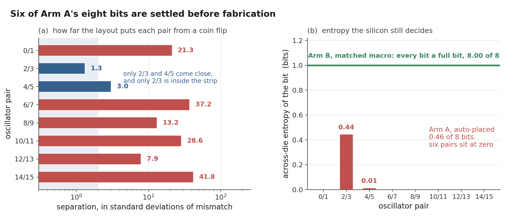
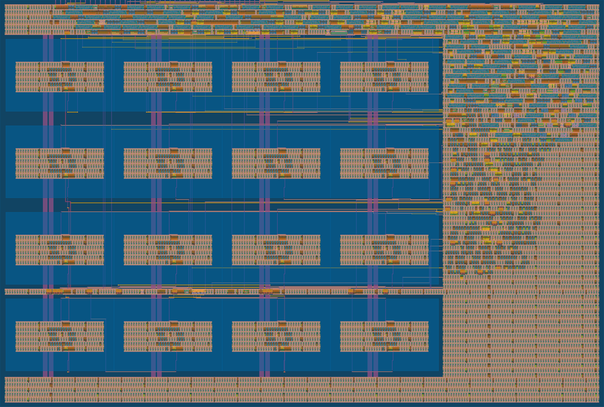

# SILICON: how much of a ring-oscillator PUF response is decided before fabrication

A ring-oscillator PUF is supposed to get its secret from manufacturing
randomness. On an open shuttle the layout is not secret. The GDS, the routed
netlist and the extracted parasitics are public downloads, and the automated
flow hands each oscillator its own parasitic load, which every die from that
mask then inherits. So this repository asks how much of the response those
files already decide, before a single chip is made. The design is a TinyTapeout
2x2 tile in the SkyWater 130 nm process, and everything here is pre-silicon:
routed layouts, extracted parasitics, and nominal SPICE.

I am a self-taught student and built the project with open tools on a home PC.
The analysis code and the scripts that recompute the headline numbers are all
in the repo, and so are the raw logs behind most of them: the corner sweep, the
sixteen Arm B instances, the selector sweep, the supply sweep and the macro RC
comparison. Three runs are the exception and only their result CSVs are here.
The sixteen-ring distributed-RC comparison, the counter-boundary flop sweep and
the seven boundary sweeps through the selector were analysed out of `/tmp` and
the waveforms never came back. Those decks regenerate deterministically, so you
can repeat those three runs, but you would be repeating them rather than
checking mine.

## The experiment

Both arms hold the same 31-stage oscillator circuit. Arm A lets the flow
place and route each of its 16 oscillators separately. Arm B places 16 copies
of one hardened macro on a regular grid, so every instance has the same
internal layout. If Arm A carries a frequency pattern that repeats from chip
to chip and Arm B does not, the automated flow is building a shared bias into
a circuit whose whole job is to be unpredictable.

## What the design files already decide

Arm A forms eight response bits by comparing neighbouring oscillators. Taking
each pair's routing-induced frequency difference from the extraction, and a
first-order 0.062% per-ring mismatch estimate for the part a die contributes,
six of those eight bits carry less than a hundredth of a bit of across-die
entropy. They are the same on every chip. The arm holds 0.46 bits of 8, and
someone with nothing but the files in this repository would call 7.91 of the 8
correctly on average.

The mismatch estimate is the weakest number in that chain, so the totals are
also reported across its sampling interval: 0.30 to 0.69 bits and 7.84 to 7.95
bits guessed. What is left sits almost entirely in one bit, the pair with the
smallest routing separation, which is where the argument says it should sit.

The correction the RO-PUF literature uses for systematic variation does not
help here. Cross validated, a quadratic surface in x and y comes out 20.0%
worse than doing nothing, because a per-instance routing fingerprint has no
smooth spatial surface underneath it. Reading the design database does work:
ring capacitance and series resistance together remove 89.5% of the dispersion
out of sample.

That model does not even have to be fitted on this build. A capacitance slope
taken from the earlier 32-oscillator layout, a different RTL revision on an
independent placement, and never refitted, removes 88.2% and calls all eight
bits the same way the full simulation does, so the 7.91 is unchanged. Two rings
of that other build are enough to fit it. Shuffle which ring owns which
capacitance and the whole thing collapses to worse than no correction at all.
A reader needs this repository's extraction; a reader does not need to simulate
it, and that was most of what the work would have cost.

Subtracting that correction as a countermeasure is worth its own paragraph,
because it half works. Compensating each ring by its predicted layout term
lifts across-die entropy from 0.46 bits of 8 to 2.91 and drops the effectively
fixed bits from six to one, which is more recovery than I expected to find. It
buys no secrecy at all: the correction is computed from files in this
repository, so a reader subtracts the same numbers and still calls 7.19 of the
8, against 4.00 for guessing. Making a response vary more across dies and
making it unknown to somebody holding the design database turn out to be
different problems, and only the first one responds to compensation.

Arm B comes out the other way, and that is now measured rather than assumed.
Sixteen instances of one macro share their internal routing, but not the enable
and output route each one carries at the top level, so "the offset is zero" was
a claim about the inside of the macro doing duty for a claim about the whole
thing. The sixteen per-instance runs settle it: the leftover is not a loading
effect, since eleven of sixteen read faster than a reference ring with no
top-level route and capacitance cannot do that; nothing in the design database
predicts it at more than one corner; and the eight bits keep 7.9997 of 8 with a
reader calling 4.02 against 4.00 for guessing. Scripts:
`sim/spice/gono/predictable_bits.py`, `compensation.py`, `compensated_bits.py`,
`build_transfer.py` and `matched_arm.py`.

## Where that comes from

The current design has a coherent build: one flow run from the current RTL
that passes Magic DRC, KLayout DRC, XOR, LVS, antenna, and power grid with
zero violations, and whose extracted parasitics drive the go/no-go below. In
that build Arm A spreads 5.53% peak to peak in nominal post-layout simulation.

A single build only shows what the router happened to do that once, so I
repeated the flow nine times with the source, floorplan, constraints, tool, and
PDK frozen and only the placement density varied. Those nine builds land between
4.19% and 6.99%, with a median of 5.75%, so the shipped build sits near the
middle of the group.

The spread moves around, but the mechanism behind it does not. In every build
frequency tracks extracted ring capacitance at about -0.999 with a slope near
-4.94 MHz/fF, and a capacitance fit trained on one build predicts another
build's individual frequencies to roughly 0.1%. Details in
`dualarm/placement_sweep/`.

The model takes each ring net's extracted capacitance from the SPEF and puts
it back into the SPICE deck as a load, so the tight frequency-versus-capacitance fit (r near -0.999) is mostly the model doing what a
capacitance-loaded oscillator has to do. Since capacitance is the only
per-instance input, the coefficient is not an independent validation; the
informative quantities are the spread itself and the routing capacitance that
the mask freezes in place. A capacitance fit trained on the earliest build
predicts the coherent build's 16 frequencies with 0.14% mean absolute error
and rank correlation 0.997, so the mechanism carries across builds even
though the pattern does not.

The hardened macro simulates at 566.0 MHz against the SPEF's real RC network,
and at 570.6 MHz with the same capacitance lumped one node per net. Its 16 Arm B
copies are the same
GDS, so the matched arm removes internal-layout variation by construction.
That is why the figure draws Arm B as one reference line; the sixteen have since
been run individually and sit inside 0.0025% of each other, so the line is now
shorthand for sixteen results rather than a stand-in for them.
It does not yet show that Arm B's total spread on real chips is lower than
Arm A's: top-level routing, supply, temperature, and device mismatch still act
on each copy, and only silicon can settle that:

These are nominal simulations of specific routed layouts. Whether the pattern
survives on fabricated dies, and how it compares with real device mismatch,
is exactly what the chip is built to measure. [SIGNOFF.md](SIGNOFF.md) lists
what each build shows and where the gaps are.

A render of the dual-arm layout: the matched 4x4 macro grid on the left, the
auto-placed standard-cell sea on the right.

## Status

The current two-arm design has a coherent DRC/LVS-clean candidate build from
its own RTL (see [SIGNOFF.md](SIGNOFF.md)). It is a candidate for the TTSKY26c
shuttle, not a finished tapeout. The 32-to-1 selection path from the
oscillators to the counter has now been simulated at the fast corner, so that
particular gap is closed, but only three of the 32 paths were swept at the
stopping boundary and the narrowest pulse the first flop saw there was 80 ps
against a library minimum of 77.5 ps. The corner sweep now covers both arms:
Arm A's sixteen rings at ss, tt and ff, and since 2026-08-10 Arm B's sixteen
instances at the same three corners, carrying their real enable and output
routes. Arm B spreads 0.0001, 0.0025 and 0.0009 percent peak to peak there,
against 5.46, 5.53 and 5.56 percent for Arm A. The boundary coverage, and the
rest of the hardware work, are listed in
[docs/hardware_todo.md](docs/hardware_todo.md). After fabrication the plan is to measure both arms across
chips, voltage, and temperature with the scripts in `firmware/`. What I expect
on silicon: Arm A shows more cross-chip pattern correlation than Arm B. The
data can also prove me wrong.

Operating notes for the chip itself are in [docs/info.md](docs/info.md). The
paper source is [docs/paper_draft.md](docs/paper_draft.md); build it with
`sh docs/build_paper.sh`. Simulation details live in
[docs/gono_results_writeup.md](docs/gono_results_writeup.md).

## Repository layout

    src/      TinyTapeout project sources (RTL, macro views, config)
    test/     TinyTapeout cocotb tests
    rtl/      original RTL and simulation-only oscillator model
    tb/       self-checking Verilog testbenches
    sim/      architectural models, SPICE decks, logs, and analysis
    macro/    hardened oscillator macro and final views
    array/    standalone 16-copy macro-array builds and PDN debug artifacts
    dualarm/  current integration kit plus an older diagnostic build snapshot
    firmware/ measurement and analysis scripts for fabricated devices
    docs/     paper source, methods notes, related work, and figures

## Reproducing the results

`make` runs the RTL testbenches (Icarus Verilog needed). Most headline numbers
re-derive from checked-in raw logs with the verify scripts. For the three runs
named at the top of this file there is nothing to re-derive from, so the SPICE
has to be repeated against a local sky130A PDK rather than checked. Exact commands,
environment variables, and what a rerun does and does not prove are in
[REPRODUCIBILITY.md](REPRODUCIBILITY.md).

## Citation and license

Citation metadata is in [CITATION.cff](CITATION.cff). Apache License 2.0;
see [LICENSE](LICENSE).
