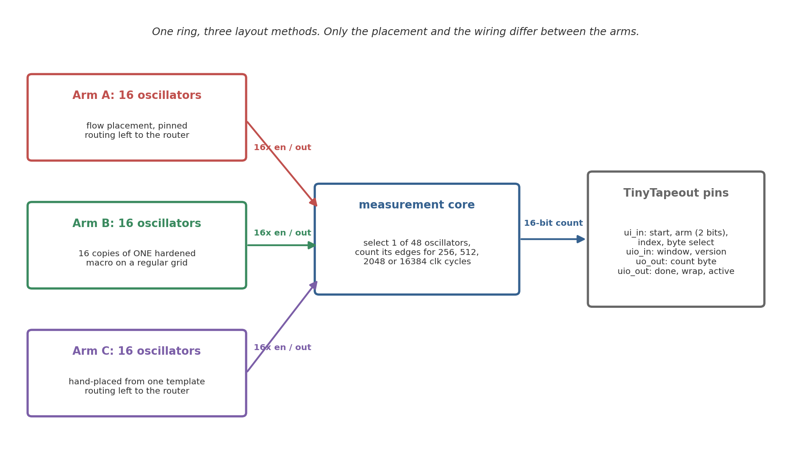
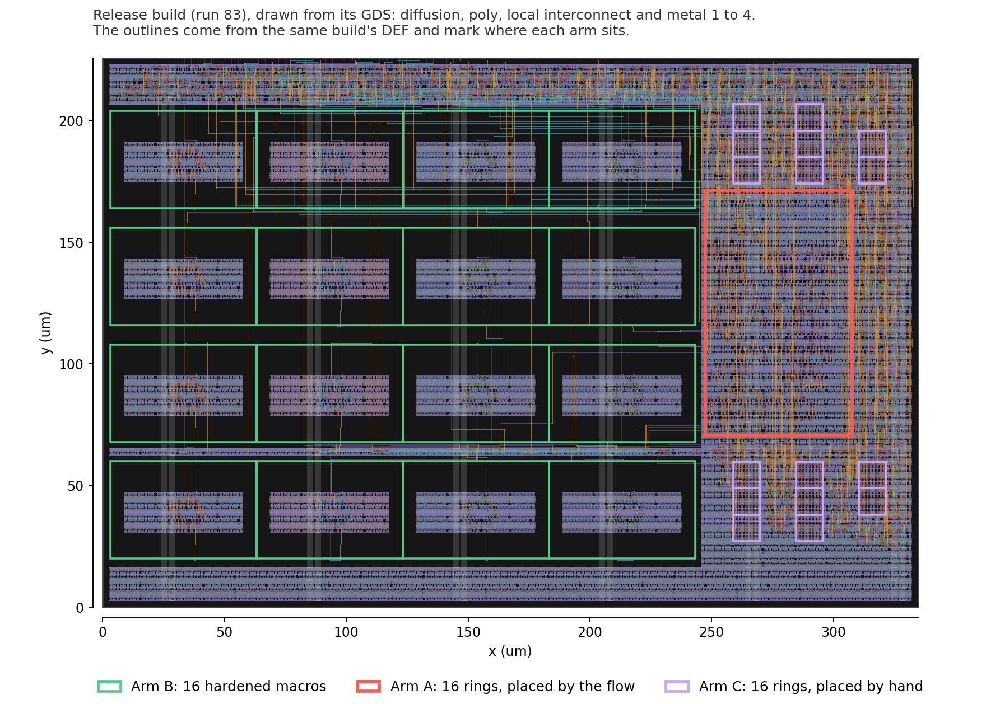

# SILICON: how much of a ring-oscillator PUF response is decided before fabrication

A ring-oscillator PUF is supposed to get its secret from manufacturing
randomness. On an open shuttle the layout is not secret. The GDS, the routed
netlist and the extracted parasitics are public downloads, and the automated
flow hands each oscillator its own parasitic load, which every die from that
mask then inherits. So this repository asks how much of the response those
files already decide, before a single chip is made. The design is a TinyTapeout
2x2 tile in the SkyWater 130 nm process, and everything here is pre-silicon:
routed layouts, extracted parasitics, and nominal SPICE.

I am a self-taught student and built the project with open tools on a home PC.
The analysis code and the scripts that recompute the headline numbers are all
in the repo, and so are the raw logs behind most of them: the corner sweep, the
sixteen Arm B instances, the selector sweep, the supply sweep, the macro RC
comparison, and the distributed-RC runs on the release build.

Three early runs are the exception and only their result CSVs are here: the
sixteen-ring distributed-RC comparison on the baseline, the counter-boundary
flop sweep and the seven boundary sweeps through the selector. They were
analysed out of `/tmp` and the waveforms never came back. The decks regenerate
deterministically, and on 17 September all three were run again on a different
machine, with a different ngspice and PDK install, and came back the same to
the printed digit ([docs/phaseG_spice_rerun.md](docs/phaseG_spice_rerun.md)).
That is a repeat, not a check against my original logs.

## The experiment

All three arms hold the same 31-stage oscillator circuit, sixteen copies each
and 48 in all, and they differ only in how the layout was made. Arm A takes the
placement the automated flow chose and leaves the wiring to the router, so
every oscillator gets its own. Arm B places 16 copies of one hardened macro on
a regular grid, so every instance has the same internal layout. Arm C puts its
16 rings down by hand from one template, the same 32 cells at the same offsets
in sixteen identical regions, and leaves the wiring to the router again.

If Arm A carries a frequency pattern that repeats from chip to chip and Arm B
does not, the automated flow is building a shared bias into a circuit whose
whole job is to be unpredictable. Arm C sits between them. Its placement is as
uniform as Arm B's and its wires are as free as Arm A's, so what separates it
from Arm B is the routing.

A measurement selects one of the 48, counts its edges for 256, 512, 2048 or
16384 reference-clock cycles, and hands back a 16-bit count a byte at a time.
The pinout and the protocol are in [docs/info.md](docs/info.md).

## What the design files already decide

Each arm forms eight response bits by comparing neighbouring oscillators, 0
against 1, 2 against 3 and so on. Take each pair's routing-induced frequency
difference from the extraction, and a first-order 0.062% per-ring mismatch
estimate for the part a die contributes, and ask how much of each bit is left
for the die to decide.

On the build that goes to the shuttle, almost none of it. That is run 83's
three-arm build, kept in `dualarm/build_armc/`. Seven of Arm A's eight bits
carry less than a hundredth of a bit of across-die entropy, the arm holds 0.07
bits of 8, and someone with nothing but the files in this repository would call
7.99 of the 8 correctly on average.

The two closest pairs sit 2.4 and 3.6 mismatch standard deviations apart.
Across the sampling interval of the mismatch estimate the arm holds 0.02 to
0.22 bits and a reader calls 7.97 to 8.00. Ordering the rings by their
extracted capacitance alone, with no simulation at all, already calls all
eight.

The method was worked out on the two-arm build that came before it, frozen in
`dualarm/build_current/` as the baseline. There six of the eight bits were
settled, the arm held 0.46 bits of 8 and a reader called 7.91 (0.30 to 0.69
bits and 7.84 to 7.95 across the same interval).

Between the two builds nothing about Arm A moved except wire. The 512 Arm A
cells sit at the same coordinates in both, to the database unit. The router
took different paths to them around the new arm, one ring's loop capacitance
moved by 3.4 fF, and two of the eight bits flipped, pairs 0/1 and 8/9:
`01101000` on the baseline, `11100000` on the release build. They flip the same
way at ss, tt and ff and under both the lumped and the full RC model.

So a prediction belongs to one routed database, not to a placement, and it has
to be read from the build that is actually fabricated. On an open shuttle that
is the build whose files get published.

Arm C is simulated now as well, from the same extraction. Its sixteen rings
carry 9.90 fF of loop capacitance on average with a standard deviation of 0.55,
against 14.66 and 1.77 for Arm A on the same die, and their frequencies spread
2.19% peak to peak where Arm A's spread 5.88%. The standard deviation of the
sixteen is 0.36 of Arm A's.

Fixing the placement takes out about two thirds of the spread, then, and none
of the predictability. The closest Arm C pair is still 3.7 mismatch standard
deviations apart, the arm holds 0.00 bits of 8, and a reader calls 8.00. Its
bits, `11010110`, come out the same at ss, tt and ff.

The rest of this section was measured on the baseline and has not been repeated
on the release build.

The correction the RO-PUF literature uses for systematic variation does not
help here. Cross validated, a quadratic surface in x and y comes out 20.0%
worse than doing nothing, because a per-instance routing fingerprint has no
smooth spatial surface underneath it. Reading the design database does work:
ring capacitance and series resistance together remove 89.5% of the dispersion
out of sample. That model does not even have to be fitted on this build. A
capacitance slope taken from the earlier 32-oscillator layout, a different RTL
revision on an independent placement, and never refitted, removes 88.2% and
calls all eight bits the same way the full simulation does, so the 7.91 is
unchanged. Two rings of that other build are enough to fit it.

Shuffle which ring owns which capacitance and the whole thing collapses to
worse than no correction at all. A reader needs this repository's extraction; a
reader does not need to simulate it, and that was most of what the work would
have cost.

Subtracting that correction as a countermeasure half works. Compensating each
ring by its predicted layout term lifts across-die entropy from 0.46 bits of 8
to 2.91 and drops the effectively fixed bits from six to one. It buys no
secrecy at all: the correction is computed from files in this repository, so a
reader subtracts the same numbers and still calls 7.19 of the 8, against 4.00
for guessing.

Making a response vary more across dies and making it unknown to somebody
holding the design database turn out to be different problems, and only the
first one responds to compensation. Arm B comes out the other way, and it is
measured now, not assumed. Sixteen instances of one macro share their internal
routing, but not the enable and output route each one carries at the top level,
so "the offset is zero" was a claim about the inside of the macro doing duty
for a claim about the whole thing.

The sixteen per-instance runs settle it: the leftover is not a loading effect,
since eleven of sixteen read faster than a reference ring with no top-level
route and capacitance cannot do that; nothing in the design database predicts
it at more than one corner; and the eight bits keep 7.9997 of 8 with a reader
calling 4.02 against 4.00 for guessing.

The pairing is the one free parameter left, and turning it does not help much
either. Which rings get compared is the order the generate loop emitted;
sixteen rings split into eight pairs 2,027,025 ways, and enumerating all of
them the best takes 0.62 bits off a reader, 16% of what he holds above
guessing, and charges about half a bit of reliability for each one, because a
comparison small enough to hide from a reader is a comparison that drifts.

Three of the 120 candidate pairs sit in both windows and they are three pairs
of the same three oscillators, so a design can use one. Scripts:
`sim/spice/gono/predictable_bits.py`, `compensation.py`, `compensated_bits.py`,
`build_transfer.py`, `matched_arm.py` and `pairing_policy.py`. The release
build and Arm C go through `predictable_bits.py --par --rc` on
`rc_validation_3arm.csv` and `rc_validation_armc.csv`, and
`verify_predictability.py` re-derives every figure in this section with its own
code.

## Where that comes from

The release build is run 83, on commit `8f8939a`, the first with all three arms
placed. Its own checks held all 512 Arm A cells and all 512 Arm C cells at
their coordinates with none resized, and found all 32 standard-cell ring loops
intact as one NAND, thirty inverters and a tap buffer. It passes Magic DRC,
KLayout DRC, LVS, antenna and routing DRC with zero violations, and its
extracted parasitics drive every release-build number above.

In nominal post-layout simulation its Arm A spreads 5.73% peak to peak with
each net's capacitance lumped, 5.63% at ss and 5.83% at ff, and 5.88% with the
full RC network.

A single build only shows what the router happened to do that once, so on the
baseline I repeated the flow nine times with the source, floorplan,
constraints, tool, and PDK frozen and only the placement density varied. Those
nine land between 4.19% and 6.99%, with a median of 5.75%. The baseline itself
spread 5.53%, and the release build's 5.73% is inside the same range.

The spread moves around, but the mechanism behind it does not.

In every baseline build frequency tracks extracted ring capacitance at about
-0.999 with a slope near -4.94 MHz/fF, and a capacitance fit trained on one
build predicts another build's individual frequencies to roughly 0.1%. Details
in `dualarm/placement_sweep/`.

The model takes each ring net's extracted capacitance from the SPEF and puts it
back into the SPICE deck as a load, so the tight frequency-versus-capacitance
fit (r near -0.999) is mostly the model doing what a capacitance-loaded
oscillator has to do. Since capacitance is the only per-instance input, the
coefficient is not an independent validation; the informative quantities are
the spread itself and the routing capacitance that the mask freezes in place.

A capacitance fit trained on the earliest build predicts the baseline's 16
frequencies with 0.14% mean absolute error and rank correlation 0.997, so the
mechanism carries across builds even though the pattern does not.

The hardened macro simulates at 566.0 MHz against the SPEF's real RC network,
and at 570.6 MHz with the same capacitance lumped one node per net. Its 16 Arm
B copies are the same GDS, so the matched arm removes internal-layout variation
by construction.

That is why the figure draws Arm B as one reference line; the sixteen have
since been run individually and sit inside 0.0025% of each other, so the line
is now shorthand for sixteen results rather than a stand-in for them. Those
runs carry the baseline's top-level routes. The release build moved them, and
the sixteen have not been run again on it.

It does not yet show that Arm B's total spread on real chips is lower than Arm
A's: top-level routing, supply, temperature, and device mismatch still act on
each copy, and only silicon can settle that:

These are nominal simulations of specific routed layouts. Whether the pattern
survives on fabricated dies, and how it compares with real device mismatch, is
exactly what the chip is built to measure. [SIGNOFF.md](SIGNOFF.md) lists what
has been run against the release build and where the gaps are, with the
baseline's results in a table of their own.

## Status

Run 83 is the candidate for the TTSKY26d shuttle, with gds, precheck and the
gate-level test green on it. It is not a finished tapeout. On 20 September the
shuttle page still listed TTSKY26d as upcoming, with a November deadline.

On that build STA is clean at all nine corners, the worst setup slack 9.20 ns
at the slow corner and the worst hold slack 0.110 ns at the fast one. There are
291 slew violations at the slow corner, all on 30 control nets the flow split
with its own delay buffers (the select decode, the counter reset, the start
pulse), none on a ring, and each of those nets settles in the quiet clock cycle
the state machine leaves before a ring is enabled.

The 48-to-1 selector from the rings to the counter has been simulated at the
fast corner on all 48 paths and every edge arrives. The counter's stopping
boundary, swept through the slowest of those paths, resolves to a rail on all
38 phases; the most a boundary can cost is one count, about 23000 being a
normal reading at the 2048-cycle window.

The physical side was checked against run 83's own files on 20 September, in
[docs/phaseG_realworld.md](docs/phaseG_realworld.md). A running ring burns
about 0.23 mW at tt and 0.4 mW at the fast corner and warms its own patch of
silicon by under 0.2 K, which moves a pair's gap by 0.0015% at most.

The busiest ring wire carries 0.46 mA/um RMS where the sky130 tech LEF allows
6.1, the power rails and vias sit further inside their limits than that, and no
drawn wire is closer to its neighbour than the spacing rule. The supply sags
0.3 to 0.6 mV under a running ring through the grid in the DEF, and that
changes no bit.

The corner sweep covers Arm A at ss, tt and ff on both builds, Arm C at the
same three on the release build, and Arm B's sixteen instances at all three
corners on the baseline's routes: 0.0001, 0.0025 and 0.0009 percent peak to
peak there, against 5.46, 5.53 and 5.56 percent for Arm A on the same build.

Still open: the fine boundary sweep through the release build's slowest
selector path, which has only had the coarse one; Arm B's sixteen instances
want running on the release build's routes; and the soft obstruction around
Arm A wants one build of its own to show whether it is still earning its
place. The rest of the hardware list is in
[docs/hardware_todo.md](docs/hardware_todo.md).

After fabrication the plan is to measure all three arms across chips, voltage,
and temperature with the scripts in `firmware/`. What I expect on silicon: Arm
A shows more cross-chip pattern correlation than Arm B, and Arm C's rings
spread less than Arm A's. The data can also prove me wrong.

Operating notes for the chip itself are in [docs/info.md](docs/info.md). The
paper source is [docs/paper_draft.md](docs/paper_draft.md); build it with
`sh docs/build_paper.sh`. Its abstract and Section 7.4 are about the release
build, and most of the rest was measured on the baseline and says so.
Simulation details live in
[docs/gono_results_writeup.md](docs/gono_results_writeup.md).

## Repository layout

    src/         TinyTapeout project sources (RTL, macro views, config)
    test/        TinyTapeout cocotb tests
    rtl/         original RTL and simulation-only oscillator model
    tb/          self-checking Verilog testbenches
    chip/        tapeout records and the scripts that check them
    extraction/  two earlier Tiny Tapeout PUFs, read from their public files
    sim/         architectural models, SPICE decks, logs, and analysis
    macro/       hardened oscillator macro and final views
    array/       standalone 16-copy macro-array builds and PDN debug artifacts
    dualarm/     build_armc, the release build; build_current, the baseline
    firmware/    measurement and analysis scripts for fabricated devices
    docs/        paper source, methods notes, related work, and figures

## Reproducing the results

`make` runs the RTL testbenches (Icarus Verilog needed). Most headline numbers
re-derive from checked-in raw logs with the verify scripts. For the three runs
named at the top of this file there is nothing to re-derive from, so the SPICE
has to be repeated against a local sky130A PDK rather than checked. Exact
commands, environment variables, and what a rerun does and does not prove are
in [REPRODUCIBILITY.md](REPRODUCIBILITY.md). How a sky130A tree for ngspice was
put together from the pinned library repositories, when the usual installer
could not be reached, is in
[docs/phaseG_spice_rerun.md](docs/phaseG_spice_rerun.md).

## Citation and license

Citation metadata is in [CITATION.cff](CITATION.cff). Apache License 2.0;
see [LICENSE](LICENSE).
