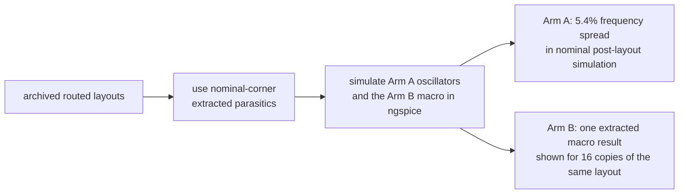

# SILICON: deterministic layout bias in a ring-oscillator PUF

This repository is a pre-silicon study of a ring-oscillator Physically
Unclonable Function (RO-PUF) in the open SkyWater 130 nm process. It asks a
practical question: how much frequency variation can an automated ASIC layout
flow add before manufacturing variation is present?

Archived nominal post-layout simulations predict a substantial
layout-dependent component. The current candidate puts an auto-placed arm and
a matched-macro arm on the same TinyTapeout 2x2 block so that the prediction
can be checked on real devices after fabrication. The current RTL is newer
than the archived dual-arm physical snapshot, so a fresh green flow is required
before ordering. Until silicon measurements exist, cross-die repeatability and
security impact remain hypotheses.

I am a self-taught student and built the project with open tools on a home PC.
The repository includes the routed inputs, raw simulation logs, analysis code,
and focused verification scripts used for the results below.

## The idea in one picture

A PUF derives a response from manufacturing differences between nominally
identical circuits. A deterministic layout contribution can bias those
responses. This chip has two arms with the same oscillator circuit but
different physical implementation:

Arm A lets the flow place and route each oscillator separately. Arm B reuses
one hardened oscillator macro sixteen times. The comparison is designed to
test whether Arm A carries a frequency pattern that repeats across chips and
whether matching the internal macro layout reduces that pattern.

## What the post-layout model predicts

- In nominal post-layout simulation of an archived dual-arm build, Arm A
  spans 5.4% peak-to-peak. An earlier all-auto-placed build spans 8.8%. In the two
  builds, frequency is strongly associated with extracted ring capacitance
  (Pearson *r* = -0.999 and -0.997). This isolates a deterministic layout
  contribution; it does not by itself show how often response bits repeat
  across fabricated chips.
- Arm B uses sixteen instances of the same hardened GDS. A single simulation
  of that macro's extracted internal parasitics gives 569.5 MHz, within 0.35%
  of the earlier auto-placed build's mean. The figure repeats this one macro
  result sixteen times to show the shared internal layout. It is a structural
  prediction, not sixteen separate measurements.
- A preliminary mismatch scale is estimated from 40 global PDK mismatch draws
  and a first-order `sqrt(31)` scaling argument. It gives 0.062% per-ring
  sigma and an approximate layout-to-mismatch ratio near 20 by standard
  deviation. The 40-run sample gives a sampling-only interval of 0.051% to
  0.080% for that scaled value, but uncertainty in the scaling model is not
  quantified. This is not a direct independent-device Monte Carlo result;
  silicon measurements will be the useful test.

The archived dual-arm prediction is summarized here. The green Arm B points
are the same extracted macro result repeated for the sixteen identical
internal macro layouts:

An archived diagnostic render is shown below. The 4x4 macro grid is on the
left and the auto-placed standard-cell arm is on the right. It was generated
from the older RTL revision and is not the current candidate GDS:

## Status

The current two-arm 2x2 source targets the TTSKY26c shuttle. It is not yet
represented by the checked-in `dualarm/build_debug/` snapshot: that bundle is
older, mixed-stage, and incomplete. The current configuration enables KLayout
DRC and XOR, and the GitHub GDS workflow must complete GDS, precheck,
gate-level test, and viewer jobs for the current commit before submission.
See [SIGNOFF.md](SIGNOFF.md) for the exact evidence boundary. After
fabrication, the plan is to measure both arms across chips, voltage, and
temperature. The registered prediction is that Arm A will show more cross-chip
pattern correlation than Arm B; the data may confirm, weaken, or reject it.
Measurement scripts are in `firmware/`.

At run time, keep the reference clock active until `done`. To abort safely,
assert reset or deselect the project before stopping the clock; both paths shut
down an enabled oscillator asynchronously. Reset release is synchronized to the
reference clock before the measurement logic resumes.

The paper source is [docs/paper_draft.md](docs/paper_draft.md). The checked-in
PDF and DOCX in `docs/paper/` carry a source-and-figure fingerprint that is
checked in CI. The detailed simulation notes are in
[docs/gono_results_writeup.md](docs/gono_results_writeup.md).

## Repository layout

    src/      TinyTapeout project sources (RTL, macro views, config)
    test/     TinyTapeout cocotb test
    rtl/      original RTL and simulation-only oscillator model
    tb/       self-checking Verilog testbenches
    sim/      architectural models, SPICE decks, logs, and analysis
    macro/    hardened oscillator macro and final views
    array/    standalone 16-copy macro-array builds and PDN debug artifacts
    dualarm/  current integration kit plus an older diagnostic build snapshot
    firmware/ measurement and analysis scripts for fabricated devices
    docs/     paper source, methods notes, related work, and figures

## Reproducing the archived post-layout prediction

The RTL tests require Icarus Verilog. The post-layout runs require ngspice and
a local sky130A PDK. Set `PDK_ROOT` to the directory containing `sky130A` and,
if needed, set `PDK` to another PDK directory name. The portable runner makes a
temporary deck with local include paths and does not overwrite a tracked deck.
The historical PDK and ngspice revisions were not recorded, so treat the
checked-in raw logs as archived evidence rather than bit-for-bit references.

From the repository root:

    # RTL testbench
    make

    # Fresh Arm A analysis. The DEF and SPEF must come from the same final run.
    # Keep regenerated files outside the archived evidence directory.
    export PDK_ROOT=/absolute/path/to/pdks
    export PDK=sky130A
    export FRESH_SPEF=/absolute/path/to/final/tt_um_nikodemetrashvili20_ro_puf.nom.spef
    export FRESH_DEF=/absolute/path/to/final/tt_um_nikodemetrashvili20_ro_puf.def
    export FRESH_OUT=/tmp/tt-ro-puf-dualarm
    python3 sim/spice/gono/gen_dualarm_decks.py \
      --spef "$FRESH_SPEF" --def "$FRESH_DEF" --output-dir "$FRESH_OUT"
    python3 sim/spice/run_ngspice.py "$FRESH_OUT/dualarm_ctrl.spice" \
      --log "$FRESH_OUT/dualarm_ctrl_out.txt"
    python3 sim/spice/run_ngspice.py "$FRESH_OUT/dualarm_par.spice" \
      --log "$FRESH_OUT/dualarm_par_out.txt"
    python3 sim/spice/gono/verify_dualarm.py \
      --spef "$FRESH_SPEF" \
      --ctrl "$FRESH_OUT/dualarm_ctrl_out.txt" \
      --par "$FRESH_OUT/dualarm_par_out.txt"

    # Arm B: one hardened-macro extraction at two timesteps
    python3 sim/spice/run_ngspice.py sim/spice/gono/ro_macro_matched.spice \
      --log /tmp/macro_out.txt
    python3 sim/spice/run_ngspice.py sim/spice/gono/ro_macro_matched_fine.spice \
      --log /tmp/macro_fine_out.txt
    python3 sim/spice/gono/verify_macro.py \
      --log-5p /tmp/macro_out.txt --log-1p /tmp/macro_fine_out.txt

The earlier 32-oscillator build is retained under
`sim/spice/gono/first_build/` and can be regenerated with `gen_decks.py`.
Running `gen_dualarm_decks.py` without fresh input paths intentionally rejects
the checked-in mixed-stage DEF before writing any output.
The verify scripts default to the archived logs; they are consistency checks,
not substitutes for an independent replication. Portable commands and the
evidence-freshness limitations are detailed in
[REPRODUCIBILITY.md](REPRODUCIBILITY.md).

## Citation and license

Citation metadata is in [CITATION.cff](CITATION.cff). The project is licensed
under the Apache License, Version 2.0; see [LICENSE](LICENSE).
