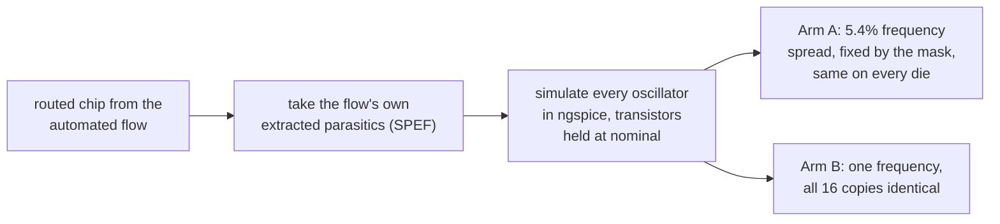
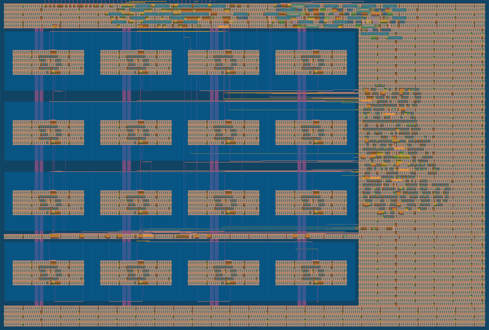

# SILICON: an open ring-oscillator PUF on sky130

This is my chip project. It is a ring-oscillator Physically Unclonable
Function (RO-PUF) for the open-source SkyWater 130 nm process. The project
asks one question: when a fully automated open-source ASIC flow builds an
RO-PUF, does the layout tool itself add a hidden bias that breaks the
security? My answer, from simulation of the real routed chip, is yes, and
the bias is large. The repo also contains the fix.

I am a self-taught student and I built everything here with open tools on a
home PC. Every number below can be re-checked from the raw files with the
scripts in `sim/spice/gono/` and `sim/spice/mc/`.

## The idea in one picture

A PUF makes a secret key from random manufacturing differences between
identical circuits. That only works if the differences are really random.
My chip has two "arms" with the exact same circuit, built in two different
ways:

If the frequencies in Arm A follow a pattern that is the same on every
chip, that pattern is not entropy. It only looks like entropy. An attacker
can learn it from one chip and predict the keys of all other chips.

## What I found

The main numbers, all from simulation of the routed layout:

- In the submitted two-arm chip the automated flow spreads the auto-placed
  arm's identical oscillators by 5.4% peak-to-peak. An earlier build with
  all 32 oscillators auto-placed showed 8.8%, so the effect repeats across
  builds. Routing capacitance explains the spread almost completely
  (r = -0.999 and -0.997). The pattern comes from the mask, so every
  fabricated die would carry the same one. This is fake entropy.
- The fix is one hardened oscillator macro, repeated 16 times as exact
  copies. Identical layout means identical parasitics, so the layout spread
  is zero by construction. The matched oscillator runs at 569.5 MHz, within
  0.35% of the auto-placed arm's mean, so the design keeps its operating
  point.
- The real entropy under the bias is small: a Monte Carlo run over the
  PDK's mismatch models gives a per-oscillator sigma of 0.062%. The layout
  bias is about 20 times bigger than that. A naive RO-PUF on this flow
  ships a key that is mostly layout, not silicon.

Both arms measured from the one submitted chip:

And this is the chip itself. Arm B is the neat 4x4 grid of identical blocks
on the left. Arm A is inside the sea of standard cells on the right:

## Status

The two-arm chip is built and checked: DRC, LVS, antenna and power-grid
connectivity all clean, TinyTapeout precheck passed, and the same checks are
green on TinyTapeout's own CI. It goes to fabrication on the TTSKY26c
shuttle. When the chips come back I will measure both arms across dies,
voltage and temperature, and the results will be added here. The prediction
is written down before the silicon exists: the auto-placed arm's pattern
should repeat across chips and the matched arm's should not. The measurement
firmware is already written and tested in `firmware/`.

The paper draft with all numbers is `docs/paper_draft.md` (PDF in
`docs/paper/`). The full results writeup is `docs/gono_results_writeup.md`.

## Repository layout

    src/      the TinyTapeout project sources (RTL, macro, config)
    test/     the TinyTapeout RTL test (cocotb)
    rtl/      original RTL and the simulation-only oscillator model
    tb/       self-checking testbenches
    sim/      SPICE decks and analysis (gono = the main experiment,
              mc = the mismatch Monte Carlo)
    macro/    the hardened oscillator macro (GDS/LEF and final views)
    array/    16-copy matched array builds and power-grid debug files
    dualarm/  the dual-arm integration kit and build artifacts
    firmware/ measurement scripts for the demo board (silicon day)
    docs/     paper, writeup, related work, build plans, figures

## Reproducing the simulations

Requires Icarus Verilog for the RTL test and ngspice plus the sky130 PDK
for the SPICE work. The short version:

    # RTL testbench
    make

    # the main experiment (its inputs ship in sim/spice/gono/first_build/)
    cd sim/spice/gono
    python3 gen_decks.py
    ngspice -b ro_all_ctrl.spice -o ctrl2.txt
    ngspice -b ro_all_par.spice  -o par2.txt
    python3 verify.py

Every result file in the repo has a matching verify script that re-derives
the numbers from raw logs with independent code.

## License

Licensed under the Apache License, Version 2.0. See [LICENSE](LICENSE).
