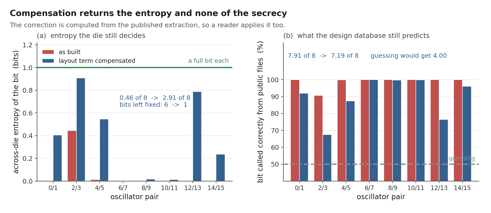

# Deterministic layout contribution in an RO-PUF: pre-silicon results

This note records the nominal post-layout simulations behind the SILICON
project's numbers. Inputs, generated decks, raw ngspice logs, and analysis
scripts live under `sim/spice/gono/`. The scientific argument and the
limitations discussion are in the paper; this file keeps the run detail.

## Summary

An earlier build routed 32 logically identical ring oscillators separately.
With transistors held at the nominal corner, a lumped-capacitance model from
the routed SPEF produced an 8.8% peak-to-peak frequency spread, and
frequency tracked extracted ring capacitance with Pearson *r* = -0.997.
Arm A of the archived dual-arm layout shows the same mechanism at 5.4%
peak-to-peak and *r* = -0.999. Arm B's comparison point is one nominal
simulation of the hardened macro's extracted internal parasitics, 566.0 MHz
against the real RC network, drawn as a reference line because all sixteen
instances share that internal GDS. The sixteen have since been run individually
with the top-level routes they actually carry: what separates them is not their
routes, nothing in the design database predicts it, and the eight Arm B bits
keep 7.9997 of 8 against Arm A's 0.46.

## Design under test

The top module, `tt_um_nikodemetrashvili20_ro_puf`, contains two
16-oscillator arms and one shared counter. Each oscillator has an enable
NAND, 30 inverters, and a buffered tap at the middle of the ring. Arm A is
built from standard cells placed and routed with the surrounding logic.
Arm B instantiates the hardened `ro_macro_hard` block sixteen times.

The earlier 32-oscillator baseline is retained because it provides a second
routed layout on which to check whether the capacitance association was
peculiar to one flow run. It was not.

## Method

### Routed inputs

The generator reads the nominal-corner routed netlist, SPEF, and DEF emitted
by the flow. The netlist identifies every Arm A ring node, the SPEF gives
each net's total capacitance, and the DEF supplies placement centroids. The
analysis scripts perform no new RC extraction.

### SPICE model

For each Arm A oscillator, the generator reproduces the ring topology and
places the SPEF `*D_NET` total capacitance on each ring node as a grounded
lumped load. Two combined decks come out: a control deck with no extracted
capacitance, and a nominal post-layout deck with it.

On the chip only one oscillator is enabled at a time. In the generated deck
all 16 reconstructed oscillators run concurrently; under this reduced model
that changes nothing, since they share only an ideal 1.8 V source and no
coupling elements are carried over. Series wire resistance is dropped
entirely, and I have not quantified its effect yet, which is one of the jobs
of the planned distributed-RC comparison. Transistors stay at nominal values to isolate
implementation differences. Each oscillator starts with enable low and is
released with an enable pulse, and frequency is measured over twenty periods
after startup.

## Earlier 32-oscillator build

All 32 no-parasitic instances read 633.640 MHz in the generated control
deck, which checks that the generator gave them the same topology and
stimulus.

With extracted capacitance the mean is 567.6 MHz. The population standard
deviation across the 32 routed instances is 10.8 MHz, 1.90% of the mean.
Frequencies run from about 539.1 MHz (RO10) to 589.2 MHz (RO4), a 50.2 MHz
or 8.8% peak-to-peak spread. Extracted ring capacitance runs from 7.4 to
17.8 fF. Frequency and capacitance have Pearson *r* = -0.997 with a fitted
slope of -4.93 MHz/fF. That extracted capacitance is the only thing the model
varies, so a correlation this strong is expected; the slope and the 8.8%
spread are the parts that carry physical meaning. Correlation with placement
centroid is weak (absolute *r* below 0.27 for the tested coordinates), so the
spread behaves like a per-instance routing fingerprint rather than a die-wide
gradient.

## Hardened Arm B macro

The `ro_macro_hard` layout passes the checked-in DRC, LVS, and antenna
checks, and its standalone 16-copy array passes DRC, LVS, antenna, and
power-connectivity checks. Reusing the macro gives each instance the same
internal ring geometry.

The macro's own nominal SPEF is simulated with the same startup and
lumped-capacitance method. The no-parasitic control reads 633.15 MHz, within
0.08% of the earlier control. The extracted result is 569.5 MHz, 10.1% below
its control, with 11.01 fF of extracted ring capacitance. Applying the
earlier Arm A capacitance fit to that load predicts 570.2 MHz, 0.12% above
the macro simulation, and the macro lands within 0.35% of the earlier Arm A
mean. A 5 ps versus 1 ps timestep comparison moves the result by about 0.2%,
which bounds the numerical error well below the layout effect.

That 569.5 MHz is the lumped-capacitance model and it is not the last word on
this macro. The same macro was rebuilt from the extraction's full RC network on
2026-08-07 and runs at 566.05 MHz, a shift of 0.801%. The rebuilt lumped deck in
that run returned 570.62 MHz, which reproduces the independent ideal-supply
figure to seven significant figures and identifies the 0.2% timestep sensitivity
above as the source of the gap rather than the model. Three numbers, three
questions; `docs/hardware_todo.md` item 7 has the comparison.

The macro has since been rebuilt from the SPEF's real network rather than one
grounded capacitor per net, the same treatment Arm A got. That gives 566.05 MHz
against 570.62 for the lumped model at the same 1 ps timestep, a shift of
-0.801%. The two lumped figures differ only by the timestep, and the 1 ps one
reproduces the Arm B ideal-supply frequency of 570.616 MHz that the supply sweep
produced through a separate generator, to seven significant figures. So 566.0 is
the number to compare against Arm A's distributed results and 570.6 against its
lumped ones. The matched arm
removes the internal-layout term by construction. It does not show that Arm B
has a smaller total spread than Arm A; that comparison needs fabricated
chips.

## Coherent dual-arm build

The current design is built in one coherent flow run on a TinyTapeout 2x2
block, and `gen_dualarm_decks.py` reads that run's nominal SPEF and DEF. The
build passes Magic DRC, KLayout DRC, XOR, LVS, antenna, and power grid with
zero violations, so these numbers and the manufacturable GDS come from the
same place. The no-parasitic control gives all 16 instances 633.64 MHz. With
extracted capacitance, Arm A runs from 540.0 to 570.7 MHz: 30.7 MHz or 5.53%
peak-to-peak, mean 554.7 MHz, population standard deviation 1.65%, and
*r* = -0.9997 against ring capacitance with a fitted slope of -4.94 MHz/fF.
Ring loads span 10.9 to 17.0 fF and form a smooth band; the two heaviest
differ by 0.34 fF, so no single instance drives the range here.

The top-level SPEF does not expand the sealed macro internals (the extractor
cannot tell the sixteen copies apart), so in this figure Arm B is represented by
the single 569.5 MHz macro result as a reference line. Item 8 later extracted
all sixteen instances individually, with the enable and output routes each one
carries, and found them within 0.0025% of each other, so the reference line is
now a shorthand backed by sixteen runs rather than a stand-in for them. That reference sits above the Arm A
mean but not above every instance: RO7 reaches 570.7 MHz on a 10.9 fF load,
about 0.2% past the macro, which is finer than this model resolves.

Two things are worth recording beyond the single build. The 32-oscillator
build's fitted capacitance relation predicts this build's mean to about 0.1%,
so the mechanism carries across independent runs, and this build's own slope of
-4.94 MHz/fF is within a fraction of a percent of that earlier fit. The
peak-to-peak figure is much less stable than the mechanism: across nine builds
that vary only placement density it moves between 4.19% and 6.99%, median 5.75%
(`dualarm/placement_sweep/`). An older build reported 10.5%, above that band,
with most of its range coming from one oscillator loaded at 24.4 fF. The
archived `dualarm/build_debug/` snapshot (5.4%, older RTL, KLayout checks off)
is kept for contrast; this coherent build supersedes it.

## Preliminary mismatch scale

The study under `sim/spice/mc/` runs the matched macro with the PDK's
mismatch switch enabled and process variation disabled. The parameters used
by ngspice are global draws per device class, so 40 runs measure a
common-draw frequency standard deviation of 0.345%, not independent
mismatch inside one ring.

Dividing by `sqrt(31)` gives a first-order 0.062% per-ring estimate under
equal, independent stage sensitivities. The NAND's structure and unequal
device sensitivities make that scaling approximate, and 40 draws leave real
sampling uncertainty: the analyzer reports a sampling-only interval of
0.051% to 0.080% at roughly 95% coverage. The implied layout-to-mismatch
ratios (about 21.6 by standard deviation, 87 by peak-to-peak against the
archived Arm A build) are scale estimates that inherit these assumptions,
which is why the paper quotes them only as motivation for the silicon
measurement.

## Predicting the layout term and subtracting it

Deterministic ought to mean predictable. If I can work out each ring's share of
the dispersion in advance and take it back out, the layout term stops being a
wall and becomes a correction that costs nothing on the die.

The RO-PUF papers already have a correction for systematic variation and it
works on position. Die gradients are spatially correlated, so you fit a surface
in x and y and subtract it. That is the thing to beat.

It does not work here. Cross validated against the shipped build's full RC
frequencies, a quadratic surface in x and y comes out worse than leaving the
data alone. On the 32-oscillator first build it reaches 27.8%, and that is
in-sample with six free parameters, so it is a generous number. The plain
correlations agree, and it is worth saying which frequencies they belong to.
Against the full RC frequencies used for the scoring above, x gives +0.32, y
gives -0.14, and radius from the centroid gives -0.05. Against the lumped
frequencies of the same build the same three are +0.35, -0.17 and -0.07. Weak
either way, and now the two models agree, which they did not while the RC decks
were double counting coupling. A per-instance routing fingerprint
has no smooth surface under it. Fitting one adds noise instead of removing bias.

The design database is a different story. Every ring has a total capacitance and
a total series resistance sitting in the SPEF long before a wafer exists. Scored
the same cross-validated way against the full RC frequencies:

    corrector                        residual spread   removed
    nothing                                   1.739%         -
    position, quadratic in x and y            2.086%    -20.0%
    position, linear in x and y               1.970%    -13.3%
    ring resistance alone                     1.238%    +28.8%
    sum of per-net R times C                  0.516%    +70.3%
    ring capacitance alone                    0.190%    +89.1%
    capacitance and resistance                0.183%    +89.5%

Almost nine tenths of it, then. Against the mismatch estimate from the previous
section, 0.062% with a sampling interval of 0.051% to 0.080%, the uncorrected
dispersion is somewhere around 22 to 34 times the random term and the corrected
one is 2 to 4 times. That is a much better corrector than the version of this
table I had before the coupling fix, and it still does not get down to where
mismatch would be readable.

One caveat belongs on the record. Against the lumped decks a capacitance model
removes 97.6% and lands under the mismatch floor. I do not count that. The
lumped deck is handed one capacitance per net and nothing else varies, so the
fit is recovering its own input, and the full RC run is the honest test. What
the lumped runs are good for is transfer. The first build's fit, a different RTL
on a different placement, reproduces the shipped build's pattern without being
refitted.

Why the scalar correctors stop where they do is not mysterious. Two numbers
cannot stand in for 33 resistors and 65 capacitors per ring. Getting closer
means predicting from the network rather than from summaries of it, and
`gen_rc_decks.py` already runs that simulation.

What I cannot settle here is whether any of this survives fabrication. Comparing
two parasitic models of one layout bounds a pre-fab prediction from below, and
says nothing about how either model compares to a real die. The per-ring numbers
are frozen before the chips arrive, so at least the comparison will be a test
and not a fit.

Whether the residual is worth chasing at all depends on what a single reading
can resolve, and until now nothing in this project answered that. The section
below answers it in simulation. The short version is that the residual sits
about 141 times above the floor, so it is not buried.

The script is `sim/spice/gono/compensation.py`. It recomputes ring capacitance
from both SPEFs and refuses to run if it disagrees with the checked-in tables by
more than 0.01 fF.

## Does the model have to be fitted on the victim?

Everything above is scored leave-one-ring-out. That is the honest way to score a
corrector and it quietly hands an attacker fifteen of the sixteen victim
frequencies, which he would have to produce himself: the PDK, a deck per ring,
and the hours to run them. So the interesting question is not how well the model
does, it is how much of the target the model needs. There are two builds on
disk, so it can be answered.

The earlier 32-oscillator layout is a different RTL revision on an independent
placement. Fit the capacitance model on that, never refit it, and apply it to
the shipped build's full RC frequencies:

    model                                   fitted on          residual  removed
    capacitance                             earlier build        0.2046%   88.2%
    capacitance and resistance              earlier build        0.2356%   86.4%
    capacitance                             shipped, lumped      0.1853%   89.3%
    capacitance and resistance              shipped, leave-1-out 0.1828%   89.5%

Transfer costs 1.3 points out of 89.5. Turning it around, a model fitted on the
shipped build and applied to the earlier one's 32 rings removes 89.4% against
91.1% for that build's own cross-validated fit, so it is not an accident of
which build I picked as the target.

Two things fell out that I did not expect. The first is that resistance does not
travel. Its coefficient is -0.0051 on the earlier build and +0.0035 on the
shipped one, opposite signs, so the extra half point it buys inside one build is
that build's own leftovers and not a property of the ring. Capacitance alone
transfers better than capacitance and resistance in both directions. The second
is how little of the other build is needed: fit the slope on its first two rings
and nothing else, and every one of the shipped build's eight bits still comes
out the way the full simulation says.

    fitted on n rings   slope %/fF   residual   signs   bits guessed
              2           -0.7970     0.3029%    8/8        7.91
              4           -0.8813     0.1928%    8/8        7.91
              8           -0.9149     0.1703%    8/8        7.91
             32           -0.8695     0.2046%    8/8        7.91

The control is what makes it mean something. Keep every capacitance and shuffle
which ring owns it: the same model then leaves 2.343%, which is 34.8% worse than
doing nothing, and calls three of the eight bits. The load-to-ring assignment is
the information; the slope is a constant lying around anywhere.

So the target's own extraction cannot be skipped and the target's simulation
can, which is most of what the attack would have cost. The scope limit is that
both builds carry the same 32-cell ring in the same PDK, so this is transfer
across placement, routing and an RTL revision, not across designs.

Script is `sim/spice/gono/build_transfer.py`.

## How many bits does the design database already decide?

Everything above is frequencies, and what the chip hands out is bits. The two
are not the same thing, so it is worth converting one into the other.

The core compares neighbouring rings, 0 against 1 and so on up, which makes
eight bits out of Arm A. Each pair's frequency difference has two parts.
Routing sets one of them and the mask freezes it, so it is the same on every die
and it can be read out of the SPEF before anything is fabricated. Mismatch sets
the other, and that one is different on every die. The bit is the sign of the
sum. So if the routing part is much larger than the mismatch part, the sign was
settled at layout time and every chip returns the same bit.

Writing the per-die difference as a fixed offset plus noise, with the mismatch
estimate of 0.062% per ring giving 0.088% per pair across two independent rings,
the across-die probability and its entropy follow directly:

    pair    routing offset   offset/sigma   entropy   guessed
     0/1           -1.864%           21.3     0.000    100.0%
     2/3           +0.116%            1.3     0.444     90.8%
     4/5           +0.267%            3.0     0.013     99.9%
     6/7           -3.265%           37.2     0.000    100.0%
     8/9           +1.156%           13.2     0.000    100.0%
    10/11          -2.504%           28.6     0.000    100.0%
    12/13          -0.690%            7.9     0.000    100.0%
    14/15          -3.668%           41.8     0.000    100.0%

Six of the eight bits land under a hundredth of a bit of entropy. Those are
fixed. Arm A's response carries about 0.5 bits of device-specific entropy rather
than 8, and someone holding nothing but the public design files would call 7.9
of the 8 correctly on average. Pushing the mismatch estimate to the ends of its
sampling interval moves that to 0.3 to 0.7 bits and 7.8 to 8.0 correct, so the
conclusion does not hinge on the exact mismatch figure.

Almost all of what is left sits in pair 2/3, at 0.44 bits. Pair 4/5 is the next
closest and it is already down to 0.013 bits, right on the line. That the
surviving entropy sits in the closest pair is what the argument predicts, since
the routing term and the mismatch term compete and only a small routing term
leaves the die a say. The lumped decks and the full RC network agree on the sign
of all eight pairs, so a cheap model is enough to read them. An earlier version of
this file said the two closest pairs were the two the models disagreed about. That
was an artefact of the RC decks building each internal coupling capacitor twice,
and once that is fixed nothing disagrees.

Arm B used to need no arithmetic here: sixteen instances of one macro have
identical internal routing, so the offset is zero and every bit is a coin flip.
The internal part of that is true. The rest was an assumption, because the
sixteen are not identical at the top level, and the section further down measures
what the difference is worth. It comes to 7.9997 bits of 8 with a reader calling
4.02 of them, so the assumption landed in the right place; it just had no number
under it.

This is the part I think matters most for an open shuttle. My GDS, netlist and
extracted parasitics are all on GitHub. For a proprietary chip an attacker would
have to obtain the design database first. Here it is a download.

The obvious limit is that eight bits is a small response and both arms are still
simulations. The offsets in that table are model output, not measurement, and a
die that disagrees with them refutes the whole argument. That is what the
tapeout is for. Script is `sim/spice/gono/predictable_bits.py`.

## Does compensating the layout term give the bits back?

The two sections above have been sitting next to each other without talking. One
says the layout term is 89.5 percent predictable. The other says the response is
nearly fixed. So subtract the first from the second and see what happens, which
is the first thing anyone from the RO-PUF side would ask, since compensating
systematic variation is standard practice there.

Each ring gets its predicted layout term removed using the leave-one-out
capacitance-and-resistance model, the eight pair separations are rebuilt from
the residuals, and the same 0.062 percent mismatch scale is applied:

    pair    uncompensated   compensated   sigma   entropy   guessed
     0/1          -1.864%       +0.123%    1.40     0.405     91.9%   flips
     2/3          +0.116%       -0.040%    0.46     0.909     67.5%   flips
     4/5          +0.267%       -0.101%    1.15     0.546     87.4%   flips
     6/7          -3.265%       -0.390%    4.45     0.000    100.0%
     8/9          +1.156%       +0.258%    2.95     0.017     99.8%
    10/11         -2.504%       -0.269%    3.07     0.012     99.9%
    12/13         -0.690%       +0.063%    0.72     0.788     76.4%   flips
    14/15         -3.668%       +0.155%    1.76     0.237     96.1%   flips

                                     residual   entropy   guessed   fixed
    uncompensated                      1.739%    0.46/8    7.91/8   6 of 8
    compensated, leave-one-out         0.183%    2.91/8    7.19/8   1 of 8
    compensated, full 16-ring fit      0.153%    3.25/8    7.10/8   2 of 8
    a coin flip                             -    8.00/8    4.00/8   0 of 8

It works better than the section above led me to expect. Entropy goes up by a
factor of six and the fixed bits go from six to one. The compensation section
says the corrected residual "still does not get down to where mismatch would be
readable", which is true and which I had been reading as meaning the bits stay
fixed. They do not. A residual of 2.9 times the mismatch scale is well above
mismatch and still low enough for the die to start getting a vote, and those are
not the same statement.

Unlike the runs behind the sections above, this one has no `*_run_steps.md`
beside it. I did not write the prediction down before running it, so treat the
sentence above as an honest recollection rather than as the pre-registered
predictions elsewhere in this file.

What it does not do is hide anything. The correction comes out of the SPEF, the
SPEF is public, so the attacker subtracts the same numbers off the same rings
and still gets 7.19 of 8 against 4.00 for guessing. Making the response vary
more from die to die and making it unknown to a reader are two different
properties, and this only moves the first one. That distinction is the useful
thing in this section, more than the number itself.

Five of the eight signs flip, so the compensated response is a different
response rather than the same one with more noise on it. Anything enrolled
before the correction is switched on does not survive switching it on.

Three caveats, in order of how much they worry me.

The entropy total is not a stable statistic at eight pairs. Correcting with
capacitance alone leaves 0.190 percent per ring, four percent more residual than
capacitance and resistance together, and returns 1.56 bits rather than 2.91.
Entropy reads the eight pair differences and the ring-level residual does not
determine them, so a small change in corrector moves the headline by half. I
would report the direction of this result and not defend 2.91 to two decimals.

It leans on the mismatch estimate much harder than the uncompensated result
does. Across the 0.051 to 0.080 percent interval the compensated total runs 2.36
to 3.67 bits, a span of 1.31 bits, where the uncompensated one spans 0.39. That
follows from the residual sitting at 2.9 times the mismatch scale instead of 28.

And the leave-one-out row is the conservative one. Fitting on all sixteen rings
gives 0.153 percent and 3.25 bits. The true figure for a corrector that has the
whole design in front of it is nearer the second row than the first, and neither
of them is measured on a die.

Script is `sim/spice/gono/compensated_bits.py`. It stops if either figure it
inherits from the compensation section has moved, and `verify_predictability.py`
rebuilds every number above from the raw SPEF with a separate solver.

## Is any of it an artefact of the arithmetic?

Everything in the two sections above is a least-squares fit and a normal
integral over sixteen numbers. That is small enough to be wrong quietly, and
nothing in the suite was looking at the calculation itself. The existing checks
confirm the inputs are the right inputs and the outputs match the prose, and
both of those pass fine on a badly conditioned solve. So
`sim/spice/gono/numerical_audit.py` goes after the calculation. Eighteen checks,
stdlib only, seeded so two runs agree.

**The solver.** `compensation.py` forms the normal equations, which squares the
conditioning. The quadratic position surface is built from raw micrometre
coordinates and their squares, so its column norms span about 8e4 and the normal
equations see roughly 6e9 of that. Refitting everything with Householder QR,
which never forms that product, agrees to ten decimal places. And
refitting position on centred and on standardised coordinates, which takes the
column spread down to 1.4, returns 2.08617 percent every time. Position fails on
the data, not on the solve. That mattered enough to check: it is the one result
in the paper that is a negative, and a negative produced by an ill-conditioned
fit would be worthless.

**Stored precision.** Frequencies are kept to two decimals of MHz, so plus or
minus 0.005 per ring, which is 0.0013 percent on a pair difference. Redrawing
all sixteen inside that interval four thousand times moves the entropy totals by
under 0.07 bits and flips no bit in sixty-four thousand draws.

**The simulator's own floor.** This one turned up something worth writing down.
`gen_dualarm_decks.py` writes `.tran 5p` and `gen_rc_decks.py` writes `.tran
1p`, so the lumped and full-RC sets do not share a numerical resolution, and the
0.2 percent timestep sensitivity found on the macro was a 5 ps against 1 ps
comparison. The lumped set can be bounded from data already here: the lumped
deck is handed one capacitance per net and nothing else varies, so fitting
capacitance against it is recovering its own input, and the 0.0443 percent that
survives is a ceiling on per-ring numerical error plus whatever nonlinearity
frequency has in capacitance. Against that ceiling the compensated residual is
4.1 times clear and the raw layout spread 39 times. Every pair separation in
both models clears the pair ceiling of 0.0627 percent. The thin one is the
closest full-RC pair at 0.116 percent, only 1.9 times clear, and that is exactly
the pair carrying most of the surviving entropy. Nothing in the paper depends on
it, because the bits come from the 1 ps set. But re-running the lumped decks at
1 ps would retire the question, and until that happens this is the honest state
of it.

**Looking more than once.** Two families. The correctors: the paper reports the
best of six, and leave-one-out does not charge for having chosen it. A nested
loop does. Outer fold holds out a ring, inner fold picks the corrector from the
other fifteen, winner is scored on the ring neither saw. It picked capacitance
and resistance fifteen times out of sixteen, and the headline goes from 89.5 to
89.2 percent, the compensated entropy from 2.91 to 2.90 bits. Then the
correlations: eight of them, declared and Holm-corrected at 0.05. Only the two
capacitance correlations survive, at r = -0.9954 and -0.9997. No position
correlation is significant even uncorrected, the smallest p being 0.19. Worth
being careful about what that licenses: the intervals are wide, radius against
the full RC frequencies spans -0.53 to +0.46, so sixteen rings cannot say
position has no effect. What the paper claims is narrower and survives: that
position cannot be used to predict, which is a cross-validated statement and not
a significance one.

**The sample.** This is the finding. Eight pairs is one draw of what this flow
produces, so resample them. Twenty thousand draws puts a 95 percent interval of
1.12 to 4.82 bits around the compensated 2.91, and 0.00 to 1.35 around the
uncompensated 0.46. Both are wider than the mismatch sampling interval that gets
all the caveats, and far wider than the input precision. The attacker figure
over the same resample runs 6.52 to 7.76 of 8 and never approaches the 4.00 a
guess would get.

So the conclusion is about presentation rather than correctness. Nothing here is
an artefact. But the entropy totals cannot carry two decimal places and the
attack figure can, so the attack is the number to lead with and the entropy
belongs in an interval with the interval named.

## What is left in the matched arm?

The Arm B section above says the sixteen instances spread 0.0025% peak to peak
at tt, 0.0001% at ss and 0.0009% at ff. Small. That is not the same as safe, and
this whole project rests on the difference: a deterministic term only becomes a
problem when somebody can work out which ring got which share, and a term four
orders of magnitude smaller could still be perfectly computable. So Arm B gets
the same three questions Arm A got.

**Is it the routes?** No, and this is the one that settles it. A top-level route
is passive. It adds capacitance and cannot remove any, so it can only slow a
ring down, and every instance ought to sit at or below the reference ring in the
same deck, which carries no top-level route at all. Eleven of sixteen sit above
it at tt and twelve of sixteen at ff. Whatever is separating them, it is not
their routes.

**Is it predictable?** No. Every corrector from the compensation section, scored
leave-one-out at all three corners, is 21 numbers:

    corrector                          tt        ss        ff
    position, quadratic surface     -25.8%    -39.2%    -56.5%
    position, linear                 -7.3%     -7.2%    -19.4%
    total route capacitance         -11.5%    -15.2%     +1.6%
    output route capacitance        -15.3%    -16.4%     +3.6%
    enable route capacitance         -6.9%    -15.1%    -20.3%
    route resistance                -16.1%    -25.8%    +15.5%
    capacitance and resistance      -11.3%    -30.3%     +7.7%

Four are positive at all, the best +15.5%, and all four sit at the same corner.
Nothing helps at more than one. Arm A's number in that last row is +89.5%.
Position is worth a note of its own: Arm B sits on a regular four-by-four grid,
which is the one geometry the literature's fitted surface is actually designed
for, and it is the worst corrector in the table.

**Is it stable?** Not reliably. Arm A's eight pairs keep their sign across two
different parasitic models, a wider gap than two corners of one model. Arm B's
keep it 8 of 8 between tt and ss and 5 of 8 between tt and ff. Per-instance the
residuals correlate +0.56, +0.23 and +0.21 across the three corner pairs; Holm
over the three comparisons that were run leaves none of them significant, the
smallest adjusted p being 0.071. I am not going to claim the leftover is pure
noise on that. What I will claim is that nothing in the design database predicts
it and it does not survive a change of corner.

Then the bits, computed the same way as for Arm A with the measured separations
instead of the assumed zero:

    corner    entropy of 8   bits guessed   fixed bits
    tt            7.9997        4.0219          0
    ss            8.0000        4.0019          0
    ff            7.9999        4.0114          0
    Arm A            0.46          7.91          6

Four of 8 is a coin, and across the mismatch sampling interval the tt figure
runs 4.02 to 4.03. Taking the leftover at face value as if it were deterministic
buys 0.02 of a bit.

One side effect worth recording. The per-instance decks run at 1 ps, and the
sixteen carry a netlist whose external loads cannot reach the oscillation loop,
so their spread is a direct look at the transient solver's own reproducibility:
0.0025% peak to peak, 0.00076% standard deviation. Hardware item 11 bounds the
same quantity indirectly at 0.0443%, which now looks loose by a factor of
eighteen. It is measured on the macro rather than on an Arm A ring, so it does
not close item 11 by itself.

Script is `sim/spice/gono/matched_arm.py`, and `verify_predictability.py`
rebuilds the spreads, the direction counts and the bits from the three archived
logs with its own parser.

## What a reading can resolve

A residual of 0.18 percent and a mismatch scale of 0.062 percent are only
interesting if a measurement can see numbers that small. Three things decide
that. The operating point can drift between readings, the oscillator has thermal
noise of its own, and the counter returns an integer. I looked at all three. The
last one turned out to be the limit, which I did not expect.

The decks come from `gen_noise_decks.py`. They read the same shipped netlist and
SPEF as everything else here and they call `gen_dualarm_decks.py`'s own ring
builder, so the topology cannot drift between the two scripts. The 1.80 V deck
is the shipped nominal deck with a different title line. `analyze_noise.py`
refuses to report anything unless that deck returns the archived nominal
frequencies, and it checks the temperature ngspice printed in each log against
the temperature the deck asked for.

### Supply

The ring is very sensitive to its supply. Across 1.62 to 1.98 V the fitted
pushing figure is 105.9 percent per volt, so ten millivolts move a ring by about
one percent. That is seventeen times the mismatch scale. If the PUF read
absolute frequencies this would sink it.

It does not read absolute frequencies. A bit is the sign of a difference between
two rings on one die sharing one supply, so the part of the shift that hits all
sixteen equally cancels. The question is how nearly it does. The sixteen pushing
figures span 105.57 to 106.17 percent per volt, a spread of about half a percent
of the value. Taking out a single common scaling at each point, the rings depart
from each other by 0.027 percent standard deviation at 1.62 V, worst ring 0.048,
and 0.034 percent at 1.98 V, worst ring 0.063. Those are ten percent supply
excursions, well past what a regulator does, and the differential term still
lands under the mismatch scale.

### Temperature

This one surprised me and I nearly deleted it. At 1.80 V the arm mean runs
549.7 MHz at -40 C, 553.4 at 0, 554.7 at 27, 555.1 at 85, then back down to
553.9 at 125. The whole 165 degree range moves it by 0.97 percent and the
fastest point sits in the middle. My first thought was that the temperature card
never reached the models, because a ring oscillator that ignores temperature is
not a ring oscillator.

Two checks said otherwise. Every ngspice log states the temperature it ran at,
and all five matched their decks. Then four tiny decks asked for 125 C in four
different ways, using a resistor with a known temperature coefficient as the
readback, and every one of them came back at 125 C.

So I went after the physical explanation instead. A CMOS stage has two competing
temperature effects. Threshold voltage falls with heat, which speeds the stage
up, and carrier mobility falls with heat, which slows it down. Near a particular
gate overdrive the two cancel. If that is what is happening at 1.80 V, the
cancellation belongs to the overdrive and not to the circuit, so moving the
supply has to move it. Less overdrive should give a positive coefficient and
more should give a negative one. That prediction can fail.

It did not. Over the same -40 to 125 C span the coefficient is +0.053 percent
per degree at 1.62 V, +0.005 at 1.80 V, and -0.024 at 1.98 V. The sign crosses
zero close to the supply the chip actually runs at. The flat response is the
circuit.

For my measurement plan that is convenient. I have no temperature chamber and
the chips will be read in a room, so a design whose frequency barely moves
between 0 and 85 C is the one I want. The dispersion is steadier than the mean:
across those five temperatures it goes 5.66, 5.58, 5.53, 5.43, 5.36 percent. The
routing signature is close to temperature independent.

### The eight bits

Eleven operating points now exist. Both supply extremes, both temperature
extremes, and the four combinations of them. All eight Arm A pair bits keep the
same sign at every one.

That is less comfortable than it sounds. The tightest pair is separated by 0.270
percent of the arm mean, and the largest ring-to-ring departure anywhere in the
box is 0.150 percent, at 1.98 V and 125 C. The margin on that pair is a factor
of 1.8, not orders of magnitude. A pair sitting twice as close would flip
somewhere in the box, and on a real die mismatch will shift every separation.
Eight bits from one simulated layout is not a reliability result.

### Thermal noise

The oscillator's own noise needs a different deck. `noise_jitter.spice` runs
three rings, the lightest, the median and the heaviest by ring capacitance, and
measures dV/dt at the switching threshold on all 31 nodes of each, rising and
falling. It runs at a 0.5 ps step rather than 5 ps, because the band it times is
crossed in about four picoseconds and a coarse step would return the
interpolation instead of the circuit.

Noise on a node moves the crossing time by roughly the noise voltage divided by
that slope, and the noise voltage on a capacitance is about the square root of
gamma k T over C. One period contains 62 transitions and I add them as
independent. That gives period jitter of 0.94, 0.78 and 0.78 ps for rings 7, 13
and 14. The scaling follows Weigandt, Kim and Gray, and the single-ended ring
case is treated by Hajimiri, Limotyrakis and Lee.

Both assumptions push the answer upward on purpose. I set the excess noise
factor gamma to 2, the short-channel end. The capacitance is the extracted wire
capacitance alone, which is smaller than the real node capacitance once the
driven gate is counted, and a smaller capacitance means more noise. This is a
first-order estimate with a known direction of error, not a transient noise
simulation.

Counting flattens it. The window is 1000 reference cycles at 25 MHz, so 40
microseconds, which is about 22000 ring periods. Independent period jitter
averages down as the square root of that count, and 0.94 ps becomes 0.00036
percent of the frequency.

### The counter is the floor

Twenty-two thousand counts means one count is 0.0045 percent and the rounding
error is 0.0013 percent rms. That is roughly four times the thermal figure. The
oscillator is quieter than the thing reading it, which is the opposite of what I
assumed when I started.

Taking the larger of the two, the floor is 0.0013 percent. The mismatch scale
sits 48 times above it. The tightest pair separation sits 207 times above it.
The compensation residual sits 141 times above it. So the residual is not hiding
under noise, and neither is the device-specific entropy the whole design depends
on.

What this does not cover. The supply points are static offsets, not a ripple
that moves during a reading and catches different rings at different phases.
Ageing, package and the measurement instrument are absent. Every number is
nominal process on one layout. It is a simulated floor, and the silicon phase is
what turns it into a measured one. Scripts are
`sim/spice/gono/gen_noise_decks.py` and `analyze_noise.py`.

## The silicon test

The prediction: under matched measurement conditions, Arm A will show greater
centred-pattern correlation across chips than Arm B. Multiple
chips and repeated voltage and temperature measurements are needed to test
it, and a weak or negative result would force a revision of the
interpretation above. The model limitations behind all of these numbers are
collected in the paper's limitations section rather than repeated here.

## Reproducibility map

- `gen_decks.py`, `ro_all_*.spice`, `ctrl2.txt`, `par2.txt`, `verify.py`:
  earlier 32-oscillator build.
- `gen_dualarm_decks.py`, `dualarm_*.spice`, `dualarm_*_out.txt`,
  `verify_dualarm.py`: Arm A in the archived dual-arm layout.
- `gen_macro_deck.py`, `ro_macro_matched*.spice`, `macro*_out.txt`,
  `verify_macro.py`: the hardened-macro reference.
- `gen_noise_decks.py`, `noise_*.spice`, `noise_*_out.txt`, `tprobe_*`,
  `analyze_noise.py`, `verify_noise.py`: supply, temperature and the
  resolution floor.
- `compensation.py`, `predictable_bits.py`, `compensated_bits.py`,
  `build_transfer.py`, `numerical_audit.py`, `verify_predictability.py`:
  predicting the layout term, reading it as bits, moving the fit off the
  victim, and auditing the arithmetic behind all of it.
- `gen_instance_decks.py`, `armb_instances*_out.txt`,
  `instance_parasitics.csv`, `analyze_instance.py`, `verify_instance*.py`,
  `matched_arm.py`: the sixteen Arm B instances with their real top-level
  routes, and what is left in them.
- `analyze.py` plus the figure scripts: descriptive statistics and plots.
- `first_build/` and `dualarm/build_debug/`: routed inputs for the two Arm A
  analyses.

The verify scripts recompute the headline quantities from the archived logs
and exit nonzero on any mismatch. The portable runner resolves local PDK
paths in a temporary deck without editing the checked-in files.
