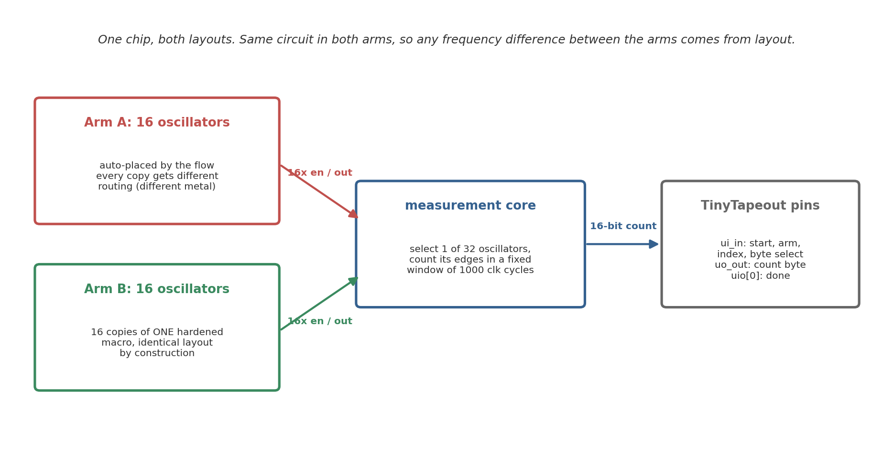
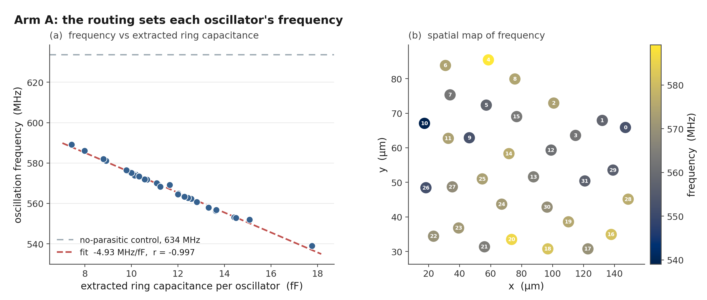
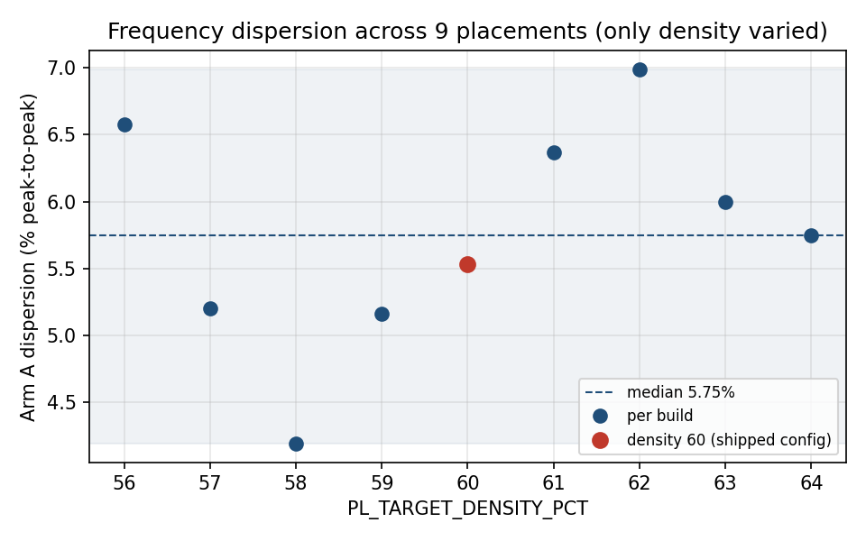
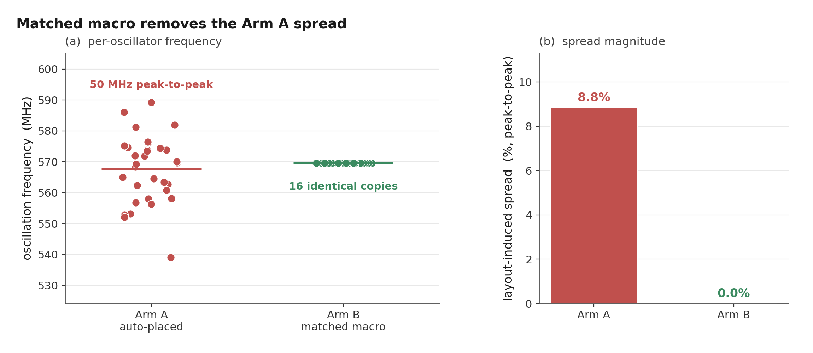
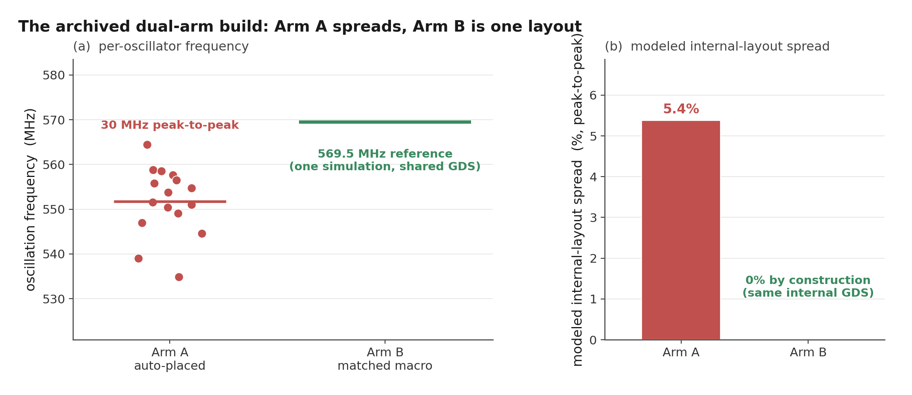

# Quantifying Routing-Induced Frequency Dispersion in an Open-Source SKY130 Ring-Oscillator PUF: A Pre-Silicon Study

**Nikoloz Demetrashvili** · Student researcher · Georgia

Draft, 2026-07-27

---

## Abstract

A ring-oscillator physical unclonable function (RO-PUF) turns manufacturing
variation between nominally identical oscillators into a device secret. The
physical implementation can add a frequency pattern of its own on top of that
variation. This paper quantifies one component of that pattern, the
instance-to-instance routing capacitance assigned by the automated
OpenLane/OpenROAD flow on the open SKY130 process design kit, using a reduced
model: nominal transistor-level models of the verified post-route oscillator
topology, loaded with each ring net's total extracted capacitance from the
final SPEF. No fabricated devices have been measured yet, and distributed
resistance and coupling are not represented.

Under this model, the 16 automatically placed oscillators of Arm A in the
candidate build spread 5.53% peak to peak (population SD 1.65%, mean
554.7 MHz), with extracted ring capacitance running from 10.9 to 17.0 fF.
Because a single build only shows one draw of the router, I repeated the whole
flow nine times over a narrow band of placement density with the source,
floorplan, constraints, tool, and PDK frozen. Dispersion across those nine
builds has a median of 5.75% and a range of 4.19% to 6.99%. What does not move
is the mechanism: every build gives a frequency-capacitance correlation of
about -0.999, and the fitted slope of -4.94 MHz/fF in the candidate build
matches the -4.93 MHz/fF obtained earlier from an independent 32-oscillator
layout. That earlier fit also predicts this build's 16 individual frequencies
to a mean absolute error near 0.1%. An older build reported 10.5%, well above
the sweep, and it owed most of that range to one oscillator the router had
loaded with 24.4 fF; no oscillator in the candidate build is loaded that way. So
a peak-to-peak number describes the build it came from, and I report the nine
builds together for that reason.

The comparison arm, Arm B, uses one hardened oscillator macro sixteen times.
A single extraction of that macro gives a 569.5 MHz reference for the shared
internal layout, which removes internal-layout variation by construction but
does not on its own prove a smaller total spread once the chips are made.

Sweeping the same arm over supply and temperature shows that the sensitivity is
almost entirely common to the sixteen oscillators. Ten percent supply excursions
leave a ring-to-ring departure of 0.03 percent, and the temperature coefficient
at 1.80 V is close to zero because the stage sits near the crossover between the
threshold-voltage and mobility effects, which a supply sweep confirms by moving
that coefficient from +0.053 to -0.024 percent per degree. Estimated thermal
jitter and the counter's own granularity put the resolution floor of a single
reading at 0.0013 percent, 48 times below the mismatch scale.

The contribution is a pre-fabrication diagnostic, traceable in the
repository, that separates nominal layout bias from the variation a PUF is
supposed to use. Whether the layout pattern repeats across dies, reduces
uniqueness, or enables a practical prediction attack is left for the silicon
phase, not claimed here.

## 1. Introduction

An RO-PUF compares the frequencies of nominally identical ring oscillators
and converts comparisons into response bits [1]. Ideally the useful
chip-to-chip differences come from manufacturing variation. In practice,
placement and routing give instances different parasitic loads, which adds a
deterministic component to the comparison.

A fixed layout pattern is not automatically a security failure. Random
mismatch may be larger, comparisons may cancel shared structure, and response
processing may absorb bias. But a layout component that repeats across chips
could reduce uniqueness or make some comparisons predictable, and deciding
between those outcomes takes measurements from multiple fabricated devices.

This paper reports the pre-silicon part of that investigation. The question
is narrow: with transistor parameters held fixed, how much frequency
variation does the physical implementation of one open-source RO-PUF design
introduce? I contribute nominal post-layout results for two automatically
placed oscillator arrays, a capacitance-based explanation for the observed
spread, a matched-macro arm that gives every instance the same internal
geometry, the scripts to run the same diagnostic before any fabrication, and
the specific predictions I plan to test once chips come back.

## 2. Background and related work

Suh and Devadas introduced the widely used RO-PUF construction [1]. Maiti and
Schaumont examined improved ring-oscillator PUF designs and compensation for
systematic effects [2], and later FPGA studies mapped spatial variation and
placement-dependent behaviour [3, 5]. Other work proposes statistical bias
reduction, configurable structures, and placement-aware designs [5-8].
Katzenbeisser et al. evaluated several PUF constructions, including ring
oscillators, across 96 ASICs [12].

The literature does not support a simple rule that any systematic structure
makes an RO-PUF predictable. Wilde, Hiller, and Pehl found that
adjacent-oscillator comparisons reduced exploitable spatial structure in
their data, and that the estimated covariance was too small for their
predictor to beat the relevant baseline [4]. That is important
counterevidence: layout bias has to be judged together with the comparison
scheme, the mismatch distribution, and the attacker model.

Open-source ASIC flows allow an experiment that closed flows make awkward:
the designer can read the routed netlist and the parasitic extraction before
fabrication instead of treating the implementation as opaque.
OpenLane/OpenROAD [9] and the open SKY130 PDK [10] provide that setting, and
a TinyTapeout RO-PUF project shows the circuit family works in the same
ecosystem [11]. What I did not find is the measurement this paper makes: the
nominal frequency component tied to instance-dependent routing in one
automated ASIC layout, quantified from the flow's own extraction.

## 3. Design under test

The candidate design, `tt_um_nikodemetrashvili20_ro_puf`, occupies a
TinyTapeout 2x2 tile. It holds two 16-oscillator arms and a shared serial
measurement core that enables one oscillator at a time and counts its edges
over a fixed window.

Each oscillator is a 31-stage ring of SKY130 standard cells: an enable NAND,
30 inverters, and an isolating output buffer tapped near the middle of the
chain. A nominal pre-layout SPICE control sits near 633 MHz. Arm A lets the
flow place and route each oscillator with the surrounding logic. Arm B
places 16 copies of one hardened oscillator macro on a regular grid. The
logical circuit is identical in both arms; the physical implementation
method is the experimental variable. Figure 1 summarizes the design.

How the measurement window is closed turned out to matter more than I first
assumed. An earlier revision clocked the ripple counter through an AND gate
that combined the selected oscillator with the window enable. That enable is
generated in the reference-clock domain and can fall at any point in a 570 MHz
cycle, so the gate could cut the final pulse on the counter's clock net down to
a sliver, which is the classic way to put a flip-flop into an illegal state.
The current design removes the gate. The counter is clocked straight from the
selected ring, and the window is enforced by enabling and disabling the ring
itself through its own NAND stage.

That change moves the boundary problem rather than removing it. Whenever the
enable drops, the last pulse the ring produces can be almost any width depending
on the phase, and a sweep of the extracted oscillator shows this directly: at
some phases the final pulse falls to about 175 ps against a nominal half-period
of 846 ps. The question is whether the counter minds. To find out I drove a real
SKY130 `dfrtp` flip-flop, wired as the first ripple stage, from the extracted
ring and dropped the enable at 38 phases covering a full period. At every phase
the flop settled to a clean rail, never sat near mid-supply, and the captured
total varied by exactly one count between phases. The ring stop therefore costs
at most one edge in roughly twenty thousand, which the core's settle handshake
absorbs by publishing a count only after three consecutive equal reads. Decks
and checkers are in `sim/spice/gono/`.

One caveat matters for interpretation: the two arms are not identical apart
from internal-layout matching. Hardening inserts input and output delay
buffers at the Arm B macro boundary that Arm A does not have, the sixteen
Arm B macros occupy a regular block on one side of the tile while Arm A fills
the rest, and the two arms differ in local decap and power-delivery geometry.
The comparison is therefore a matched hardened-macro implementation against
a conventional automated standard-cell implementation, not two circuits that
differ only in internal routing; the ring loops themselves stay logically
equivalent.

The boundary difference is larger than the buffer count suggests, and worth
quantifying rather than mentioning. Taken from the top-level extraction, the
capacitance each arm's ring output drives spans 0.24 to 2.71 fF in Arm A, mean
0.84, against 2.89 to 29.46 fF in Arm B, mean 14.46. Arm B drives roughly
seventeen times the load, because its macros sit at fixed positions across the
tile while Arm A's oscillators are placed near the shared multiplexer. That load
is also why the flow puts a driver on the macro output; attempting to remove it
only moves the problem, since the resizer then alters the ring's tap buffer
instead.

The same geometry places the two arms in different parts of the die. The sixteen
macros tile a region roughly 300 by 184 micrometres, while the automatically
placed oscillators occupy a box of about 44 by 78 on one side. I tested whether a
less one-sided floorplan could remove this, by skipping the middle column of the
power grid so a standard-cell channel runs through the macro field. Two variants
built and passed every physical check, and both spread Arm A considerably wider,
but in each one the placer stretched a single oscillator into a thin line, 126 and
106 micrometres long, roughly doubling that instance's routing load and pushing
the array's capacitance spread from 44% of the mean to 199% and 135%. Four macro
rows is the maximum that fits the die, sixteen macros in four rows therefore need
four columns, and only five column positions align with the power grid, so the
shipped arrangement is the one that leaves the automatically placed arm a single
contiguous region. The regional difference is a consequence of die area, macro
footprint and grid pitch rather than a tuning choice, and removing it would need a
larger tile. Both trials are recorded in the repository.

What protects the frequency result is that all of this lies outside the
oscillator loop. The loop is the enable NAND and thirty inverters with feedback,
and the only boundary cell touching it is the tap buffer, which is a `buf_1` in
both arms. The enable buffer is further irrelevant during a measurement, since
the enable is static while the window is open and the ring is driven through the
feedback node. So the extra output stage and the heavier output route cannot bias
the frequencies reported here, though they would have to be accounted for in any
comparison of edge quality or bit reliability between the arms.

The main results below come from a coherent build of the current
RTL that passes the physical checks (Magic and KLayout DRC, XOR, LVS, antenna,
detailed route, power grid) with zero violations; two earlier builds, an
archived dual-arm snapshot and a 32-oscillator layout, are reported for
contrast (see SIGNOFF.md in the repository).

## 4. Method

The analysis is four separate operations, each traceable to a checked-in
file. First, the physical flow produces the gate-level netlist, DEF, and
nominal-corner SPEF. Second, a structural verifier
(`verify_ring_topology.py`) parses the final netlist and confirms that every
Arm A oscillator kept exactly one enable NAND, 30 inverters, and one tap
buffer, with no cell inserted into the loop; the deck generation is only valid
if this holds. Third, the generator reconstructs that verified topology from
nominal SKY130 transistor-level cell models and attaches each ring net's SPEF
`*D_NET` total capacitance to the matching node as a grounded lumped
capacitor. It does not simulate the extracted network itself. Fourth, ngspice
transient simulation (1.8 V, 27 C, nominal TT models) measures each
oscillator's frequency, with a parallel control deck carrying no extracted
capacitance. The SPEF declares `PIN_CAP NONE`, so pin capacitance is not part
of the transferred load.

On the chip, one oscillator runs at a time. The combined simulation deck
enables all 16 reconstructed oscillators concurrently, which is equivalent
under this model because they share only an ideal supply and the reduced model
carries no coupling between them. Distributed wire resistance is omitted
entirely; its effect is not quantified here and is one reason the
distributed-RC comparison is required. Each oscillator starts disabled and is released
by an enable pulse, which avoids a simulation artefact where an artificial
initial condition excited an unintended ring mode. Frequency is measured
over 20 periods after startup.

For the matched arm, the hardened macro is extracted and simulated once.
The 16 instances share one internal GDS, so this single result serves as
the internal-layout reference for all of them.

For each automatically placed array I report mean, standard deviation,
range, peak-to-peak spread relative to the mean, and the Pearson correlation
between frequency and extracted ring capacitance. Instances inside one
routed design are not independent samples from a chip population, so these
are descriptive statistics for that layout. Standard deviations are
population values across those instances, which are the complete set for a
layout, not a sample from a wider population. The extracted capacitance is also
the only spread-producing input to the model, so a strong frequency-capacitance correlation is expected almost by construction. The coefficient
confirms the model behaves; the spread it produces, and the slope, are the
physically interesting parts.

## 5. Automatically placed arrays

### 5.1 Earlier 32-oscillator layout

The earlier build placed all 32 oscillators automatically. In the
no-parasitic control every deck produced the same nominal frequency,
approximately 633.640 MHz, which checks the generator itself. With extracted
capacitance the mean was 567.6 MHz with a population standard deviation of
10.8 MHz (1.90%).
Frequencies ranged from about 539 to 589 MHz, a 50.2 MHz or 8.8%
peak-to-peak spread.

Extracted ring capacitance ranged from 7.4 to 17.8 fF. Frequency and
capacitance had Pearson *r* = -0.997 with a fitted slope of about
-4.93 MHz/fF (Figure 2a). Correlations with placement coordinates were much
weaker (|*r*| < 0.27; Figure 2b). For this layout the spread behaves like an
instance-specific routing load, not a smooth die-wide gradient.

### 5.2 Coherent dual-arm build

Arm A of the candidate build contains 16 automatically placed oscillators.
Their nominal post-layout frequencies average 554.7 MHz and span 30.7 MHz from
end to end, which is 5.53% of the mean, with a population SD of 9.15 MHz
(1.65%). The slowest ring is RO14 at 540.0 MHz carrying 17.0 fF; the fastest is
RO7 at 570.7 MHz carrying 10.9 fF. Correlation against extracted ring
capacitance is -0.9997 and the fitted slope is -4.94 MHz/fF (Figure 4). The
loads in this build form a fairly smooth band rather than a distribution with a
straggler: the two heaviest rings differ by 0.34 fF, so no single instance
dominates the range, and dropping any one oscillator leaves the spread between
4.7% and 5.5%. The build passes Magic DRC, KLayout DRC, XOR, LVS, antenna, and
power grid with zero violations, and the netlist verifier confirms all 16 rings
survived place and route with no cell inserted into a loop, so the dispersion
estimate and the candidate GDS come from the same signed-off run.

An earlier build of this design reported 10.5%. That number came from a layout
in which the router gave one oscillator 24.35 fF while the other fifteen sat
between 11.7 and 16.95 fF, and that single instance carried most of the extreme
range; without it the same build measured 4.60%. Nothing was wrong with the
build, and the heavy instance was a real routing outcome rather than a
measurement fault, but a peak-to-peak statistic computed over sixteen instances
is sensitive to exactly that kind of draw. The sweep in Section 5.3 is what
settles how typical it was.

Putting two builds' spread figures side by side is a fairly weak comparison. A
better one is whether a fit from one build predicts the individual oscillators
of another. A linear capacitance fit trained only on the 32-oscillator build
(624.6 MHz - 4.93 MHz/fF) predicts the frequencies of later builds to roughly
0.1% mean absolute error with rank correlation near 0.997, and the candidate
build's own fitted slope, -4.94 MHz/fF, sits within a fraction of a percent of
that independently trained value. Each layout gets its own pattern of loads. The
relationship converting those loads into frequencies is the same one every time.

### 5.3 Dispersion across nine builds

A peak-to-peak figure from one layout says little about what the flow does in
general. LibreLane 3.0.3 does not expose the
place-and-route seed, so a strict seed-only replicate set was not available.
Instead I varied one neutral placement knob, the target placement density, in
1% steps from 56% to 64%, and froze everything else: the RTL, the macro
locations, the floorplan, the constraints, the tool version, and the PDK. All
nine builds hardened, and all nine kept every ring intact. Read the result as a
placement-sensitivity band rather than a seed distribution.

Dispersion across the nine builds has a median of 5.75%, a range of 4.19% to
6.99%, and a standard deviation of 0.80% (Figure 5). The candidate build sits at
5.53%, close to the middle. Density itself explains little of the variation
(*r* = 0.32), which is what I expected: the knob is a way to perturb placement,
not a physical cause. Ring capacitance spread and frequency spread move
together across the whole set, from 4.7 fF and 4.19% at the tightest build to
7.8 fF and 6.99% at the widest.

Two details make the band trustworthy. The build at 60% density reproduces the
shipped configuration exactly and returned 5.53%, matching the candidate build
to the digit, and running the entire sweep a second time reproduced all nine
values without change. The flow is deterministic, so the band measures genuine
placement sensitivity rather than run-to-run noise. Against that band the older
10.5% build looks like a wide draw rather than a typical outcome. If I had run
this sweep before writing up that build, I would not have quoted its number on
its own.

### 5.4 The dispersion across process, voltage and temperature

Everything above is at 27 C and 1.8 V with typical devices, which bounds nothing.
Repeating the same deck and the same extracted capacitances at a slow corner
(100 C, 1.60 V) and a fast one (-40 C, 1.95 V) gives absolute frequencies of 276.2
to 291.7 MHz and 840.3 to 888.3 MHz, against 540.0 to 570.7 at nominal. All
sixteen oscillators start at every corner, including the slow low-voltage one, and
the no-parasitic control decks return a single identical frequency per corner
(323.140, 633.640 and 987.948 MHz), which is what validates the corner setup.

The dispersion is essentially unchanged: 5.46%, 5.53% and 5.56% peak to peak at
slow, nominal and fast. The frequency-capacitance correlation is -0.9997 in every
case. The fitted slope scales with the operating frequency, -2.478, -4.936 and
-7.783 MHz/fF, but expressed as a fraction of the mean it barely moves, -0.873,
-0.890 and -0.902 percent per fF.

That is a stronger result than the nominal number alone. It says the routing
contribution behaves as a relative perturbation of whatever speed the process and
operating point set, rather than as a fixed frequency offset that a corner shift
could swamp or amplify. For the silicon phase it predicts that the per-oscillator
pattern should be recoverable from dies measured at different temperatures and
supplies, which is convenient, because holding a hobby measurement setup at one
temperature is difficult.

Two practical bounds fall out of the same simulations. The reported count is the
oscillator frequency times the window duration, so at the fast corner the 16-bit
counter reaches 35532 of 65535, leaving 1.84x headroom at the 25 MHz reference
clock and the 1000-cycle window in the design. Dropping the reference clock below
13.55 MHz, or extending the window past 1844 cycles, would push the fast corner
into a silent wrap that returns a believable smaller count instead of an error.

### 5.5 Does the lumped model survive the real RC network?

Section 4 grounds each net's total capacitance on a single node. That discards the
series resistance, collapses the split of capacitance between the ends of a net,
and treats coupling as though the far end were held quiet. The last of those is the
one to worry about here, because 47 to 62 of each ring's coupling capacitors have
their far end on another node of the same ring, usually the neighbouring inverter.
Adjacent inverter outputs move in antiphase, so grounding such a coupling
understates the load it presents.

To test it I rebuilt all sixteen oscillators from the extraction's own network,
with per-node capacitances, the series resistors as extracted, and node-to-node
capacitors wherever both ends lie inside the oscillator, then simulated the lumped
and distributed versions of each ring under otherwise identical conditions. The
reconstruction accounts for the whole of every net's declared capacitance.

Every oscillator is slower under the fuller model, by 2.16% to 5.69%, and the size
of the shift tracks the ring's extracted load (*r* = -0.589). Because the heavier
rings lose the most, the dispersion widens rather than shrinking: 5.55%
peak-to-peak becomes 7.60%. The simplification is therefore conservative with
respect to the paper's central claim. It understates the layout contribution by
roughly a third instead of manufacturing it, which is the opposite of the failure
mode a reduced model is usually suspected of.

The per-oscillator pattern also survives. Rank correlation between the two models
is 0.912 and the fastest ring is the same under both. The slowest label moves
between two oscillators that the lumped model separated by 0.7%, which is a near-tie
changing hands rather than the fingerprint dissolving.

Where the fuller model does change the answer is in the individual response bits.
The design forms bits by comparing neighbouring oscillators, and two of the eight
comparisons reverse. Both involved pairs separated by 0.28% and 0.32% under the
lumped model, while every pair separated by 0.69% or more kept its ordering. So
predicted bits from closely matched pairs are model-dependent and are not reported
here as predictions; the analysis code already flags such pairs as low-margin when
scoring measured silicon, and this gives an independent pre-silicon reason to
expect which ones will be fragile.

Two limits on this check. The Arm B macro has a separate extraction and has not
been redone this way, so its 569.5 MHz reference remains a lumped-model result.
And the extraction itself is a reduced per-net network rather than a field
solution, with coupling to nets outside a given oscillator still grounded, which
ranges from four such nets on the lightest ring to seventy-two on the heaviest.

### 5.6 What a single reading can resolve

The residual left by Section 5.5 and the mismatch scale of Section 7 are both
small, and neither means anything unless a measurement can resolve them. Three
effects set that limit. The operating point drifts between readings, the
oscillator carries thermal noise, and the counter returns an integer. The decks
in `sim/spice/gono/gen_noise_decks.py` address all three. They read the shipped
netlist and SPEF used everywhere else in this work and they call the same ring
builder, and the 1.80 V deck is the nominal deck of Section 5.2 under a
different title, which the analysis verifies against the archived log before
reporting anything.

Supply comes first. Between 1.62 and 1.98 V the fitted pushing figure is 105.9
percent per volt, so a ten millivolt change moves a ring by about one percent,
seventeen times the mismatch scale. A response bit is the sign of a difference
between two rings sharing one supply, so only the part of the shift that is not
common can affect it. The sixteen pushing figures span 105.57 to 106.17 percent
per volt. After removing a single common scaling at each point, the rings depart
from one another by 0.027 percent standard deviation at 1.62 V and 0.034 percent
at 1.98 V, with worst-ring departures of 0.048 and 0.063 percent. Ten percent
supply excursions therefore leave the differential term below the 0.062 percent
mismatch scale.

Temperature needed checking before it could be reported. At 1.80 V the arm mean
runs 549.7, 553.4, 554.7, 555.1 and 553.9 MHz at -40, 0, 27, 85 and 125 C, a
total movement of 0.97 percent with the maximum inside the range rather than at
an end. A ring oscillator with almost no temperature coefficient is a reason to
suspect the simulator. Two checks rule that out. Every log states the
temperature ngspice used and each matches its deck, and four minimal decks that
request 125 C by different mechanisms all read 125 C back through a resistor of
known temperature coefficient.

The physical explanation is a threshold-voltage effect and a mobility effect
that cancel near a particular gate overdrive, and it makes a falsifiable
prediction, because that balance point has to move with the supply. Repeating
the two temperature extremes at the two other supplies confirms it. Over the
same -40 to 125 C span the coefficient is +0.053 percent per degree at 1.62 V,
+0.005 at 1.80 V and -0.024 at 1.98 V, crossing zero close to the nominal
operating supply. Temperature-aware RO-PUF design has been treated before by
compensating for the drift [15]; here the operating point happens to sit where
there is little to compensate. Dispersion is steadier than the mean, moving only
from 5.66 to 5.36 percent across the five temperatures, so the routing signature
is nearly independent of temperature over the range a bench measurement will
see.

Across all eleven operating points, which include both supply extremes, both
temperature extremes and the four combinations of them, the eight Arm A
adjacent-pair bits keep their sign. The margin is real but not large. The
closest pair is separated by 0.270 percent of the arm mean and the largest
ring-to-ring departure in the box is 0.150 percent, a factor of 1.8. This is a
statement about one simulated layout at nominal process and not a reliability
result.

Thermal noise is estimated rather than simulated. A separate deck measures dV/dt
at the switching threshold on all 31 nodes of three rings, chosen as the
lightest, median and heaviest by ring capacitance, at a 0.5 ps timestep because
the measured band is crossed in roughly four picoseconds. Taking the noise
voltage on a node as the square root of gamma k T over C and dividing by the
local slope gives a per-transition timing error, and the 62 transitions in one
period are summed as independent, which follows the capacitance scaling of
Weigandt, Kim and Gray [13] and the single-ended ring treatment of Hajimiri,
Limotyrakis and Lee [14]. The result is 0.94, 0.78 and 0.78 ps of period jitter.
Both inputs are chosen to overstate it, with gamma set to 2 and the capacitance
taken as the extracted wire capacitance alone, which is less than the real node
capacitance.

The counting window is 1000 reference-clock cycles at 25 MHz, about 22000 ring
periods, over which independent period jitter averages down by the square root
of the count. The 0.94 ps figure becomes 0.00036 percent of frequency. The
counter is coarser than that. One count in 22189 is 0.00451 percent and the
rounding error is 0.00130 percent rms, so the instrument rather than the
oscillator sets the floor. Taking the larger of the two, the resolution floor is
0.00130 percent, which sits 48 times below the mismatch scale, 207 times below
the closest pair separation and 640 times below the compensation residual.

## 6. Matched-macro arm

The matched construction hardens one oscillator as a 60 x 40 micrometre
macro. The macro layout passes the available DRC, LVS, antenna, and
connectivity checks, and Arm B places 16 instances of it on a regular grid.

The extracted macro carries about 11.0 fF of total ring capacitance. One
nominal post-layout simulation gives 569.5 MHz against a no-parasitic
control of 633.15 MHz. The earlier Arm A capacitance fit predicts 570.2 MHz
at that load, 0.12% away, a useful cross-check on the model. The macro
result also lands within 0.35% of the earlier Arm A mean, so matching did
not move the operating point.

The macro is faster than the typical routed ring, 569.5 MHz against an Arm A
mean of 554.7 MHz, which is what the lighter load predicts. It is not faster
than every Arm A ring. RO7 in the candidate build reaches 570.7 MHz because the
router happened to give it 10.9 fF, slightly less than the macro carries. The
gap is about 0.2%, below what this lumped-capacitance model resolves, and the
macro also pays for the boundary buffers that hardening inserted and Arm A does
not have. So the defensible statement is that matching the internal layout put
the macro ahead of the average automatically routed oscillator, not ahead of
all of them.

Figures 3 and 4 draw Arm B as a single horizontal reference line at
569.5 MHz, because the sixteen instances share one internal layout and there
is only one extracted simulation behind it. By construction the internal
layout contributes zero spread; fabricated Arm B instances will still differ
through device mismatch, top-level routing, supply, and temperature. The
simulation establishes only the internal-layout contribution under nominal
device parameters. Total Arm B dispersion requires per-instance integration
parasitics and fabricated-device measurements, and whether Arm B ends up with
a smaller total spread than Arm A is the measurement the chip exists to make.

## 7. Planned silicon test

Why could a repeatable mask-defined pattern matter to a PUF at all? A layout
component shared across dies can reduce uniqueness or make some comparisons
predictable, but prior work also shows systematic structure is not
automatically exploitable: Wilde, Hiller, and Pehl found adjacent-oscillator
comparisons suppressed the spatial structure in their data and their
predictor could not beat its baseline [4]. Which way this design falls is a
question for fabricated dies, not for the nominal model. A toy population
model and a first-order mismatch-scale estimate live in the repository's
supplementary material (`sim/montecarlo.py`, `sim/spice/mc/`); their outputs
depend on assumed amplitudes and a sqrt(31) scaling that the PDK's global
mismatch draw does not really support, so no number from them appears here.

The question for silicon is whether Arm A retains more of its nominal
layout pattern across dies than Arm B. The threat model I have in mind is
concrete: an attacker knows the public design and mask and holds measurements
from other dies of the same design, but none from the target die, and asks
whether the shared deterministic layout component lets them predict the target
die's pair ordering above the relevant per-bit baseline. Predictor accuracy is
then judged against that baseline with whole chips held out, not against 50%. Testing it needs multiple chip IDs, repeated
measurements, matched voltage and temperature settings, and a fixed
comparison rule; the firmware records chip and condition labels so groups
stay separate. The planned metrics are repeatability within chip and
condition, centered pattern correlation across chips under the same
condition, inter-chip Hamming distance for a predeclared set of adjacent
comparison pairs, and within-chip response changes across voltage and
temperature. Results count only when the grouping and completeness
requirements are met; a single chip or an incomplete oscillator vector does
not support a population claim.

## 8. Limitations

This study is pre-silicon, and its model is deliberately simple. Nominal
transistor models carry no random local mismatch. The lumped-capacitance model has
now been checked against the extraction's full RC network, as Section 5.5 reports:
the dispersion survives and in fact grows, but individual comparisons between
closely matched oscillators do not, and the Arm B macro has not been re-extracted
that way. Neither model represents dynamic supply coupling between simultaneously
active oscillators, which does not arise here because the hardware enables one at a
time. The
nine-build sweep is a controlled set in the sense that only one flow knob
changed, but that knob is placement density and not the place-and-route seed,
which LibreLane 3.0.3 does not expose. A seed sweep would be the cleaner
experiment, and the band reported here should be read as placement sensitivity
measured one particular way. Builds from earlier revisions are not part of that
set and their spreads are not pooled with it. Instances within a single layout
are also related observations, so instance-level confidence intervals would
overstate the evidence. The Arm B reference is
one simulation of one macro and cannot quantify fabricated Arm B variation.
The 40-run global Monte Carlo cannot reproduce independent local device
mismatch. Voltage, temperature, supply noise, ageing, package, and
measurement-system effects are partly characterized. The corner simulations in
Section 5.4 bound the frequency range and the counter margin, and Section 5.6
measures how the arm responds to supply and temperature and where the resolution
floor of a single reading sits. Its supply points are static offsets rather than
a ripple that varies during a reading and reaches different oscillators at
different phases, and its thermal-noise figure is a first-order estimate from
node slopes and capacitances rather than a transient noise simulation. Ageing,
package effects and the measurement instrument itself remain unknown until chips
exist. Uniqueness, reliability, min-entropy and attack success all need a
multi-chip data set with a stated threat model. The corner work pairs device
corners with nominal interconnect rather than pairing the slow corner with maximum
extracted capacitance and the fast corner with minimum; device spread dominates
the frequency bound, so the bound holds, but the range would tighten slightly
under the fuller pairing. The boundary behaviour of the oscillator-clocked ripple
counter is checked at both nominal and the fast corner, which is where the shorter
period makes it hardest, though the selector path feeding it has not yet been
validated as a whole chain at 888 MHz. None of this erases the modelled
dispersion; it bounds what can be concluded from it.

## 9. Conclusion

Under a reduced lumped-capacitance model of the verified post-route topology,
the automated flow gave the 16 oscillators of the candidate build a 5.53%
peak-to-peak nominal frequency dispersion (population SD 1.65%, mean
554.7 MHz). Nine builds that differ only in placement density put that figure
in context: median 5.75%, range 4.19% to 6.99%. Any single build reports one
draw of the router, which is why I no longer quote one of them on its own.
What repeats is the mechanism. Every build shows frequency tracking extracted
ring capacitance at about -0.999, the fitted slope stays near -4.94 MHz/fF
across independent layouts, and a fit trained on one build predicts another's
individual frequencies to roughly 0.1%. A hardened macro provides a 569.5 MHz
shared-internal-layout reference for Arm B, ahead of the Arm A mean though not
of every Arm A instance. The finding is that the flow assigns materially
different routing capacitance to logically identical oscillators, and that
under nominal device assumptions this converts into a dispersion of several
percent through a relationship that holds from one routing run to the next.

Uniqueness, reliability, min-entropy, and attack success are not evaluated
pre-silicon. Whether the mask-defined pattern survives fabrication, and how
it compares against real device mismatch, will be settled by measuring both
arms of the fabricated chips under the protocol in the firmware.

## References

[1] G. E. Suh and S. Devadas, "Physical Unclonable Functions for Device
Authentication and Secret Key Generation," *Proceedings of the 44th ACM/IEEE
Design Automation Conference (DAC)*, pp. 9-14, 2007.
https://doi.org/10.1145/1278480.1278484

[2] A. Maiti and P. Schaumont, "Improved Ring Oscillator PUF: An
FPGA-Friendly Secure Primitive," *Journal of Cryptology*, vol. 24,
pp. 375-397, 2011. https://doi.org/10.1007/s00145-010-9088-4

[3] A. Maiti, J. Casarona, L. McHale, and P. Schaumont, "A Large Scale
Characterization of RO-PUF," *IEEE International Symposium on
Hardware-Oriented Security and Trust (HOST)*, pp. 66-71, 2010.
https://schaumont.dyn.wpi.edu/schaum/pdf/papers/2010hostm.pdf

[4] F. Wilde, M. Hiller, and M. Pehl, "Statistic-Based Security Analysis of
Ring Oscillator PUFs," *2014 International Symposium on Integrated Circuits
(ISIC)*, pp. 148-151, 2014. https://doi.org/10.1109/ISICIR.2014.7029528

[5] A. S. Chauhan, V. Sahula, and A. S. Mandal, "Novel Randomized Placement
for FPGA Based Robust ROPUF with Improved Uniqueness," *Journal of
Electronic Testing*, vol. 35, no. 5, pp. 581-601, 2019.
https://doi.org/10.1007/s10836-019-05829-5

[6] K. A. Asha, L. E. Hsu, A. Patyal, and H.-M. Chen, "Improving the Quality
of FPGA RO-PUF by Principal Component Analysis (PCA)," *ACM Journal on
Emerging Technologies in Computing Systems*, vol. 17, no. 3, article 34,
2021. https://doi.org/10.1145/3442444

[7] W.-C. Wang, Z. Li, J. Skudlarek, M. Larouche, M. Chen, and P. Gupta,
"UNBIAS PUF: A Physical Implementation Bias Agnostic Strong PUF,"
arXiv:1703.10725, 2017. https://arxiv.org/abs/1703.10725

[8] J. Miskelly, C. Gu, Q. Ma, Y. Cui, W. Liu, and M. O'Neill, "Modelling
Attack Analysis of Configurable Ring Oscillator (CRO) PUF Designs," *2018
IEEE 23rd International Conference on Digital Signal Processing (DSP)*,
pp. 1-5, 2018. https://doi.org/10.1109/ICDSP.2018.8631638

[9] M. Shalan and T. Edwards, "Building OpenLANE: A 130nm OpenROAD-based
Tapeout-Proven Flow," *2020 IEEE/ACM International Conference on Computer
Aided Design (ICCAD)*, article 110, pp. 1-6, 2020.
https://doi.org/10.1145/3400302.3415735

[10] SkyWater Technology and Google, "SkyWater Open Source PDK (SKY130)."
https://github.com/google/skywater-pdk

[11] litneet64, "RO-based Physically Unclonable Function in sky130
(TinyTapeout tt07)." https://github.com/litneet64/tt07-RO-based-PUF

[12] S. Katzenbeisser, U. Kocabas, V. Rozic, A.-R. Sadeghi, I. Verbauwhede,
and C. Wachsmann, "PUFs: Myth, Fact or Busted? A Security Evaluation of
Physically Unclonable Functions (PUFs) Cast in Silicon," *Cryptographic
Hardware and Embedded Systems (CHES 2012)*, LNCS 7428, pp. 283-301, 2012.
https://doi.org/10.1007/978-3-642-33027-8_17

[13] T. C. Weigandt, B. Kim, and P. R. Gray, "Analysis of Timing Jitter in CMOS
Ring Oscillators," *Proceedings of the IEEE International Symposium on Circuits
and Systems (ISCAS)*, vol. 4, pp. 27-30, 1994.
https://doi.org/10.1109/ISCAS.1994.409188

[14] A. Hajimiri, S. Limotyrakis, and T. H. Lee, "Jitter and Phase Noise in Ring
Oscillators," *IEEE Journal of Solid-State Circuits*, vol. 34, no. 6,
pp. 790-804, 1999. https://doi.org/10.1109/4.766813

[15] C.-E. Yin and G. Qu, "Temperature-Aware Cooperative Ring Oscillator PUF,"
*2009 IEEE International Workshop on Hardware-Oriented Security and Trust
(HOST)*, pp. 36-42, 2009. https://doi.org/10.1109/HST.2009.5225055
