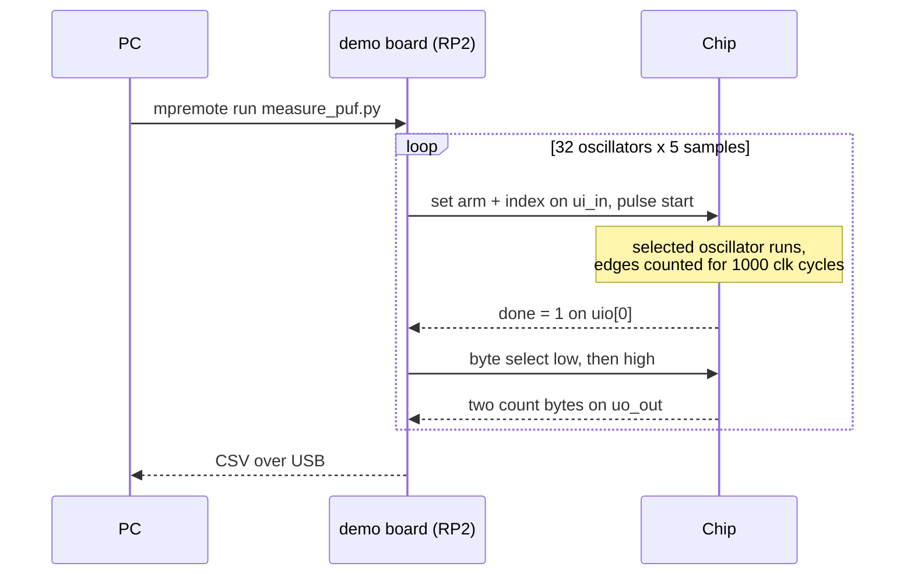

# Silicon-day measurement kit

Written before the silicon exists, so it can be tested and ready the day
the chips arrive. Protocol checked against `dualarm/src/tt_um_ro_puf.v`.

## What is here

- `measure_puf.py` runs ON the TinyTapeout demo board (MicroPython, TT SDK
  v3). It selects the project, clocks it at 25 MHz, measures all 32
  oscillators (both arms, 5 samples each) and prints CSV.
- `analyze_counts.py` runs on the PC. Give it one CSV per chip. With several
  chips it computes the number the whole project exists for: how strongly
  each arm's frequency pattern correlates ACROSS chips. Prediction: Arm A
  near +1 (shared fake entropy), Arm B near 0 (real entropy).

## How one measurement works

## One-time PC setup

    pip install mpremote

## Taking a measurement

1. Plug the demo board in over USB.
2. Edit LABEL at the top of `measure_puf.py`: chip id and condition, for
   example `chip03_room_1v8` or `chip03_freeze_1v8`.
3. Run and capture:

       mpremote run measure_puf.py > chip03_room_1v8.csv

4. Repeat per chip and per condition: room temperature, freeze spray,
   hairdryer, and a couple of supply points around 1.8 V.
5. Analyze any set of files together:

       python3 analyze_counts.py chip01_room_1v8.csv chip02_room_1v8.csv

## Notes and gotchas

- The counter is 16 bit and the window is fixed at 1000 clock cycles, so the
  clock choice sets the overflow ceiling: count = f_osc x 1000 / f_clk. At
  25 MHz the ceiling is 1.6 GHz, safe at every corner. Do not go below about
  12 MHz.
- A count of -1 in the CSV means a done-timeout; the analyzer skips them. A
  few could appear if the project mux glitches; many means something is
  wrong (check the project is enabled and clocked).
- The exact SDK calls (`DemoBoard.get()`, `tt.shuttle...enable()`,
  `tt.clock_project_PWM`, `tt.ui_in.value`, `tt.uio_out[0]`) match TT SDK v3
  as of 2026-07. If the SDK moved by silicon day, these are the only lines
  that might need a touch.
- The shuttle index name will be `tt_um_nikodemetrashvili20_ro_puf`; the
  script also falls back to `tt.shuttle.find("ro_puf")`.
